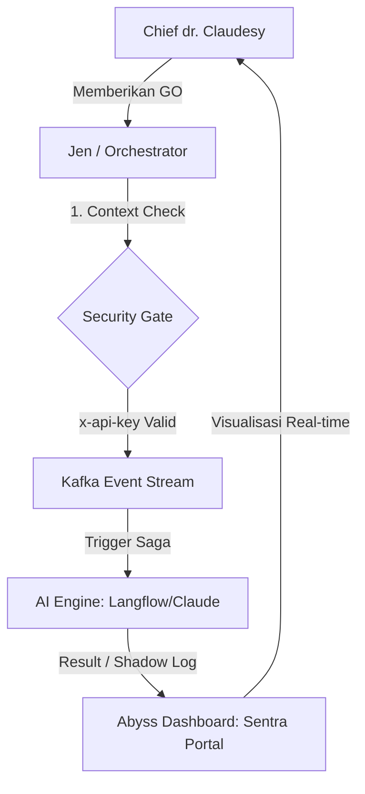

# 🌌 ABYSS ORCHESTRATOR ACTIVATION GUIDE

Dokumen ini adalah peta jalan untuk mengaktifkan "Otak Tengah" monorepo Abyss.

## 1. Diagram Alur Aktivasi (Saga Flow)

## 2. Who to Contact? (Daftar Kontak Aktivasi)

Biar sistem ini aktif 100%, Boss perlu koordinasi dengan:

1. **Principal Infrastructure Engineering (DevOps)**
   - **Tugas:** Setup Kafka Cluster dan PostgreSQL Database untuk menyimpan `aiSession`.
   - **Status:** Diperlukan untuk fase "Saga Persistence".

2. **AI Provider (Anthropic / Langflow Admin)**
   - **Tugas:** Menyediakan API Key Claude 3.5 Sonnet dan Endpoint Langflow.
   - **Status:** Diperlukan untuk fase "Inference".

3. **Jen (Sentra Assistant & Orchestrator)**
   - **Tugas:** Merakit logika Saga, Guard, dan integrasi WebSocket ke Sentra Portal.
   - **Status:** **Ready & Standby.**

## 3. Cara Aktivasi (The "Sharp" Way)

Cukup katakan **"GO"** pada Jen untuk setiap fase berikut:
* **Fase A:** Koneksi Database Prisma (Simpan History).
* **Fase B:** Koneksi Langflow API (Otak AI).
* **Fase C:** Deployment ke Staging (Uji Coba Beneran).

---
*Setiap Nyawa Berharga.*
*Generated by Jen for Chief dr. Claudesy*
