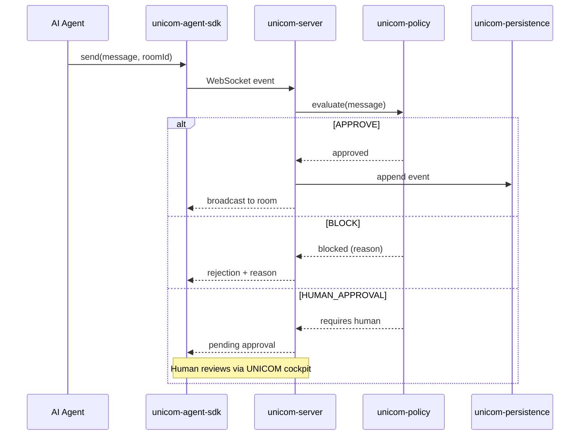
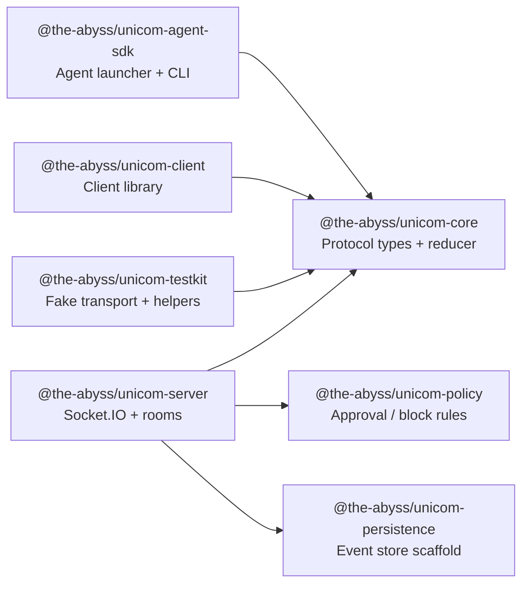
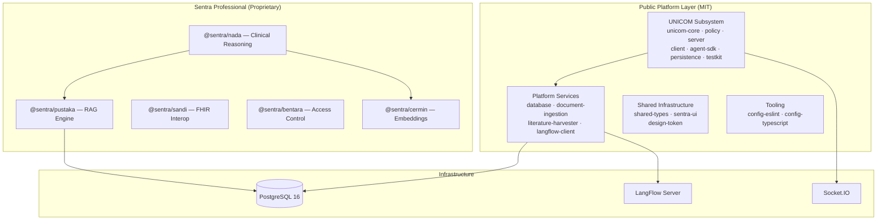

<div align="center">

# The Abyss — Monorepo

**Healthcare AI platform infrastructure — engineered to think _with_ the
clinician, not behind them.**

_Open platform foundation for healthcare AI systems: governed agent coordination
(UNICOM), typed platform services, clinical document pipelines, and a
battle-tested monorepo architecture ready for production-oriented teams._

</div>

---

## Overview

<table>
<tr>
<td valign="middle" width="180">
  
</td>
<td valign="top">

**The Abyss** is the open-platform layer of the Sentra healthcare AI ecosystem —
a production-oriented pnpm + Turborepo monorepo that ships the infrastructure
any serious healthcare AI project needs but rarely builds well: a typed
multi-agent coordination subsystem, governed document ingestion pipelines,
clinical knowledge registries, shared UI primitives, and enforced package
taxonomy.

What it does _not_ include are the proprietary Sentra clinical AI engines
(`@sentra/*`). Those live in a separate licensed tier. What it _does_ include is
every governed, reusable infrastructure piece that makes building on top of
clinical AI tractable — without the usual "glue everything together yourself"
tax.

Every package ships with TypeScript, Zod-validated contracts, Vitest tests, and
a governance tier tag. Because healthcare AI that cannot be audited is a
liability, not a product.

</td>
</tr>
</table>

---

<div align="center">


**Architect:** Dr. Ferdi Iskandar · <drferdiiskandar@sentrahai.com>

> _"Healthcare AI that cannot explain its reasoning, cannot prove its
> provenance, and cannot be audited by a human — is not healthcare AI. It is a
> liability."_

</div>

---

## Why The Abyss — Generic AI Monorepo vs. This

| Dimension                  | Generic AI Monorepo                         | The Abyss                                                                                                                        |
| -------------------------- | ------------------------------------------- | -------------------------------------------------------------------------------------------------------------------------------- |
| **Agent coordination**     | No protocol — agents talk ad-hoc or via LLM | UNICOM: typed protocol, room-based collaboration, policy-gated risk, human-in-the-loop approval, append-only event store         |
| **Package governance**     | Conventional commits + good intentions      | `AGENTS.md` supreme contract, `.agent/` SSOT, boundary classification, crown-jewel isolation tiers, orphan detection rules       |
| **Clinical document flow** | Custom parser per project                   | `@the-abyss/document-ingestion` — multi-format (JATS XML, PDF, Markdown), OCR quality gates, source hashing, normalization seam  |
| **Type safety**            | `any` at integration boundaries             | Zod-validated contracts at every package boundary, shared `@the-abyss/shared-types`, strict `tsconfig` enforced by Turborepo     |
| **Build orchestration**    | npm scripts or Make                         | Turborepo 2.x — dependency-aware pipeline, remote caching, affected-only builds, workspace integrity enforced by pnpm            |
| **PHI / clinical safety**  | "Don't log passwords" (vibes)               | Explicit `.gitignore` blocks for DICOM, HL7, FHIR dumps, vector stores, and PHI fixture paths; clinical boundary preflight gates |
| **Testing infrastructure** | Jest + manual mocks                         | Vitest across all packages; `@the-abyss/unicom-testkit` for agent fake transports; deterministic contract tests                  |
| **Literature + knowledge** | Manual copy-paste from PubMed               | `@the-abyss/literature-harvester` — open-access crawling, JATS ingestion, knowledge registry with supersession                   |

---

## Executive Summary

- **Open infrastructure layer** — 17+ MIT-licensed packages across UNICOM,
  platform, clinical, shared, and tooling namespaces.
- **UNICOM agent coordination** — The only open, typed, policy-aware multi-agent
  coordination subsystem built specifically for healthcare AI workflows.
- **Document pipeline** — End-to-end ingestion from PDF/JATS/HTML to structured
  knowledge, ready to feed any embedding or RAG layer.
- **Clinical knowledge registry** — Structured clinical references with
  supersession support, citation grounding, and audit trail.
- **Production-grade monorepo** — pnpm workspaces + Turborepo + strict
  TypeScript + shared ESLint config + Husky hooks, all pre-configured.
- **Sentra Professional tier** — Clinical reasoning, RAG, FHIR interop,
  embedding infrastructure, and access control engines available separately
  (proprietary).

### Who builds on The Abyss

| Persona                     | Role                           | Pain Point Solved                                                                |
| --------------------------- | ------------------------------ | -------------------------------------------------------------------------------- |
| **Agent developer**         | UNICOM extension author        | Typed protocol, policy SDK, room state reducers, fake transports for testing     |
| **Platform engineer**       | Infrastructure operator        | Unified build, shared configs, Turborepo pipeline, Docker Compose local stack    |
| **AI researcher**           | Knowledge pipeline contributor | Document ingestion, literature harvester, clinical reference registry            |
| **Clinical informatician**  | CDSS integrator                | Governed package boundaries, PHI-safe workspace, auditable architecture patterns |
| **Open source contributor** | Ecosystem builder              | Clean TypeScript monorepo, AGENTS.md contract, standardized governance           |

---

## Table of Contents

1. [Features Overview](#features-overview)
2. [Quickstart](#quickstart)
3. [UNICOM Agent Coordination](#unicom-agent-coordination)
4. [System Architecture](#system-architecture)
5. [Project Structure](#project-structure)
6. [Package Reference](#package-reference)
7. [Security & Privacy](#security--privacy)
8. [Developer Guide](#developer-guide)
9. [Assumptions & Open Questions](#assumptions--open-questions)
10. [Sentra Professional](#sentra-professional)
11. [License](#license)

---

## Features Overview

| #   | Package / Feature                                                                             | Status        | Namespace                         | Primary User           |
| --- | --------------------------------------------------------------------------------------------- | ------------- | --------------------------------- | ---------------------- |
| 1   | **UNICOM Core** — Typed agent coordination protocol, room state reducer, event contracts      | ✅ Live       | `@the-abyss/unicom-*`             | Agent developer        |
| 2   | **UNICOM Policy** — Approval/block rules for evidence, destructive, crown-jewel, clinical ops | ✅ Live       | `@the-abyss/unicom-*`             | Agent developer        |
| 3   | **UNICOM Agent SDK** — Agent launcher, CLI tools, fake transport for testing                  | ✅ Live       | `@the-abyss/unicom-*`             | Agent developer        |
| 4   | **UNICOM Server** — Socket.IO-backed server, rooms, event broadcasting, append-only store     | ✅ Live       | `@the-abyss/unicom-*`             | Platform engineer      |
| 5   | **UNICOM Persistence** — Append-only Postgres event storage scaffold                          | ✅ Live       | `@the-abyss/unicom-*`             | Platform engineer      |
| 6   | **UNICOM Testkit** — Fake transport, in-memory store, test helpers                            | ✅ Live       | `@the-abyss/unicom-*`             | Agent developer        |
| 7   | **Database** — PostgreSQL schema, Prisma migrations, seed data                                | ✅ Live       | `@the-abyss/database`             | Platform engineer      |
| 8   | **Document Ingestion** — JATS XML, PDF, multi-format parser, source hashing                   | ✅ Live       | `@the-abyss/document-ingestion`   | AI researcher          |
| 9   | **Literature Harvester** — Open-access literature crawling, indexing                          | ✅ Live       | `@the-abyss/literature-harvester` | AI researcher          |
| 10  | **LangFlow Client** — TypeScript client for programmatic LangFlow execution                   | ✅ Live       | `@the-abyss/langflow-client`      | Platform engineer      |
| 11  | **Clinical References** — Clinical knowledge registry, citation sources                       | ✅ Live       | `@the-abyss/clinical-references`  | Clinical informatician |
| 12  | **Shared Types** — Common TypeScript types across all packages                                | ✅ Live       | `@the-abyss/shared-types`         | All                    |
| 13  | **Sentra UI** — Shared React component library with Tailwind                                  | ✅ Live       | `@the-abyss/sentra-ui`            | Frontend developer     |
| 14  | **Design Token** — Design system tokens, spacing, typography                                  | ✅ Live       | `@the-abyss/design-token`         | Frontend developer     |
| 15  | **Config ESLint** — Shared ESLint configuration for all packages                              | ✅ Live       | `@the-abyss/config-eslint`        | Developer              |
| 16  | **Config TypeScript** — Shared `tsconfig` base for all packages                               | ✅ Live       | `@the-abyss/config-typescript`    | Developer              |
| 17  | **Flow Definitions** — LangFlow definitions for healthcare, academic, platform workflows      | ✅ Live       | `flows/`                          | Platform engineer      |
| 18  | **Clinical Reasoning Engine** (`@sentra/nada`)                                                | 🔒 Sentra Pro | `packages/sentra/`                | Clinical informatician |
| 19  | **RAG Engine** (`@sentra/pustaka`)                                                            | 🔒 Sentra Pro | `packages/sentra/`                | AI researcher          |
| 20  | **FHIR Interoperability** (`@sentra/sandi`)                                                   | 🔒 Sentra Pro | `packages/sentra/`                | Clinical informatician |
| 21  | **Access Control** (`@sentra/bentara`)                                                        | 🔒 Sentra Pro | `packages/sentra/`                | Platform engineer      |
| 22  | **Embedding Infrastructure** (`@sentra/cermin`)                                               | 🔒 Sentra Pro | `packages/sentra/`                | AI researcher          |

> 🔒 **Sentra Professional** packages are not included in this public
> repository. See [Sentra Professional](#sentra-professional).

---

## Quickstart

### Prerequisites

| Requirement | Minimum Version | Purpose                          |
| ----------- | --------------- | -------------------------------- |
| Node.js     | 22.0.0          | Runtime                          |
| pnpm        | 9.15.0          | Package manager (required)       |
| PostgreSQL  | 16+             | Database (for platform packages) |
| Git         | 2.x             | Version control                  |

> ⚠️ **Use `pnpm` only.** This monorepo uses pnpm workspaces. Do not use `npm`
> or `yarn`.

### Installation

```bash
# Clone the repository
git clone https://github.com/drclassy/monorepo-abyss.git
cd monorepo-abyss

# Install all workspace dependencies
pnpm install

# Build all packages
pnpm build

# Run tests across all packages
pnpm test
```

### Environment Setup

Copy the example environment file and fill in your values:

```bash
cp .env.example .env
```

| Variable            | Required | Description                            |
| ------------------- | -------- | -------------------------------------- |
| `DATABASE_URL`      | ✅       | PostgreSQL connection string           |
| `NODE_ENV`          | ✅       | `development` / `production` / `test`  |
| `UNICOM_PORT`       | Optional | UNICOM server port (default: `3100`)   |
| `LANGFLOW_BASE_URL` | Optional | LangFlow server URL for flow execution |

### Run UNICOM Server (local dev)

```bash
# Start the UNICOM coordination server
pnpm --filter @the-abyss/unicom-server dev

# In another terminal: run the UNICOM cockpit UI (apps/internal/unicom — local only)
# pnpm --filter unicom dev
```

---

## UNICOM Agent Coordination

UNICOM is the ABYSS-native multi-agent coordination subsystem. It provides a
typed protocol for agents to communicate, collaborate, and operate under
policy-gated risk management — with human-in-the-loop approval for high-risk
operations.

### UNICOM Flow



### UNICOM Package Map



### Policy Gate Dimensions

| Policy Dimension   | Default Action   | Override           |
| ------------------ | ---------------- | ------------------ |
| Evidence-required  | `BLOCK`          | Human approval     |
| Destructive ops    | `HUMAN_APPROVAL` | Chief-only         |
| Crown-jewel access | `BLOCK`          | Explicit grant     |
| Secret exposure    | `BLOCK`          | None               |
| External API call  | `HUMAN_APPROVAL` | Context-based      |
| Clinical boundary  | `HUMAN_APPROVAL` | Clinician override |

---

## System Architecture



### Deployment Recommendation

| Layer              | Technology          | Recommendation       |
| ------------------ | ------------------- | -------------------- |
| Runtime            | Node.js 22+, pnpm   | ✅ Required          |
| Database           | PostgreSQL 16+      | ✅ Required          |
| Agent coordination | UNICOM server       | ✅ Self-hosted       |
| Flow orchestration | LangFlow (optional) | Optional             |
| Container          | Docker Compose      | ✅ Recommended local |
| CI/CD              | GitHub Actions      | ✅ Included          |
| Monorepo build     | Turborepo           | ✅ Required          |

---

## Project Structure

```
abyss-monorepo/
├── packages/
│   ├── unicom/              # UNICOM agent coordination subsystem (7 packages, MIT)
│   │   ├── core/            #   Protocol types, room state reducer, event contracts
│   │   ├── policy/          #   Approval/block policy engine
│   │   ├── server/          #   Socket.IO-backed coordination server
│   │   ├── client/          #   Client library
│   │   ├── agent-sdk/       #   Agent launcher + CLI tools
│   │   ├── persistence/     #   Append-only Postgres event storage
│   │   └── testkit/         #   Fake transport, test helpers
│   ├── platform/            # Platform infrastructure (MIT)
│   │   ├── database/        #   PostgreSQL schema + Prisma migrations
│   │   ├── document-ingestion/ # JATS XML, PDF, multi-format ingestion
│   │   ├── langflow-client/ #   TypeScript client for LangFlow
│   │   └── literature-harvester/ # Open-access literature crawling
│   ├── clinical/            # Clinical knowledge (MIT)
│   │   └── clinical-references/ # Clinical knowledge registry + citation sources
│   ├── shared/              # Shared primitives (MIT)
│   │   ├── shared-types/    #   Common TypeScript types
│   │   ├── sentra-ui/       #   React UI component library
│   │   └── design-token/    #   Design system tokens
│   ├── tooling/             # Build tooling (MIT)
│   │   ├── config-eslint/   #   Shared ESLint config
│   │   └── config-typescript/ # Shared tsconfig base
│   └── sentra/              # 🔒 Proprietary clinical AI engines (local dev only)
│       ├── sentra-nada/     #   Clinical reasoning engine
│       ├── sentra-pustaka/  #   RAG engine
│       ├── sentra-sandi/    #   FHIR R4 interoperability
│       ├── sentra-bentara/  #   Access control (GO-gate)
│       └── sentra-cermin/   #   Embedding infrastructure
│
├── flows/                   # LangFlow definitions (MIT)
│   └── definitions/
│       ├── healthcare/      #   Healthcare domain flows
│       ├── academic/        #   Academic domain flows
│       └── platform/        #   Platform flows
│
├── infrastructure/          # IaC (Terraform, Docker, ArgoCD) — Chief-only gates
│   ├── docker/
│   ├── terraform/
│   └── argocd/
│
├── docs/                    # Project documentation
│   ├── adr/                 #   Architectural Decision Records
│   ├── guides/              #   Developer guides
│   ├── specs/               #   Product specifications
│   ├── unicom/              #   UNICOM protocol documentation
│   ├── legal/               #   Legal templates
│   ├── roo/                 #   AI tool guardrails
│   ├── blueprint/           #   Bootstrap patterns
│   └── templates/           #   Reusable templates
│
├── tooling/                 # Repo tooling and governance
│   ├── governance/          #   Agent governance healthchecks
│   ├── scripts/             #   Utility scripts
│   └── prompt-engine/       #   Prompt engineering tooling
│
├── .agent/                  # Operational SSOT (continuity + governance knowledge)
│   ├── HANDOFF.md           #   Current state, next actions
│   ├── CONTEXT.md           #   Repo identity and boundaries
│   ├── DECISIONS.md         #   Durable decisions and lessons
│   └── PROGRESS.md          #   Milestone status
│
├── AGENTS.md                # Root policy authority — READ FIRST
├── CLAUDE.md                # Claude Code entry point
├── CONTRIBUTING.md          # Contribution guide
├── SECURITY.md              # Security policy + disclosure
└── turbo.json               # Turborepo pipeline config
```

---

## Package Reference

### UNICOM Subsystem (`packages/unicom/`)

| Package                         | Version | Description                                           |
| ------------------------------- | ------- | ----------------------------------------------------- |
| `@the-abyss/unicom-core`        | 0.1.0   | Protocol types, room state reducer, Zod event schemas |
| `@the-abyss/unicom-policy`      | 0.1.0   | Policy engine — approve / block / human-approval      |
| `@the-abyss/unicom-server`      | 0.1.0   | Socket.IO server, rooms, event broadcasting           |
| `@the-abyss/unicom-client`      | 0.1.0   | Client library for connecting to UNICOM server        |
| `@the-abyss/unicom-agent-sdk`   | 0.1.0   | Agent launcher, codex-unicom-launcher CLI             |
| `@the-abyss/unicom-persistence` | 0.1.0   | Append-only Postgres event store (scaffold)           |
| `@the-abyss/unicom-testkit`     | 0.1.0   | Fake transport, in-memory store, test utilities       |

### Platform Services (`packages/platform/`)

| Package                           | Version | Description                                   |
| --------------------------------- | ------- | --------------------------------------------- |
| `@the-abyss/database`             | 0.1.0   | PostgreSQL schema, Prisma ORM, seed data      |
| `@the-abyss/document-ingestion`   | 0.1.0   | JATS XML, PDF, multi-format document parser   |
| `@the-abyss/langflow-client`      | 0.1.0   | TypeScript client for LangFlow flow execution |
| `@the-abyss/literature-harvester` | 0.1.0   | Open-access literature crawling and indexing  |

### Shared Infrastructure (`packages/shared/`, `packages/clinical/`, `packages/tooling/`)

| Package                          | Version | Description                             |
| -------------------------------- | ------- | --------------------------------------- |
| `@the-abyss/shared-types`        | 0.1.0   | Common TypeScript types across packages |
| `@the-abyss/sentra-ui`           | 0.1.0   | React component library with Tailwind   |
| `@the-abyss/design-token`        | 0.1.0   | Design system tokens                    |
| `@the-abyss/clinical-references` | 0.1.0   | Clinical knowledge registry + citations |
| `@the-abyss/config-eslint`       | 0.1.0   | Shared ESLint configuration             |
| `@the-abyss/config-typescript`   | 0.1.0   | Shared TypeScript base configuration    |

---

## Security & Privacy

### PHI & Clinical Data Protection

> ⚠️ **Clinical Data Notice:** This repository is PHI-free by design. All
> `.gitignore` patterns explicitly block DICOM, HL7, FHIR dumps, patient data
> directories, and clinical fixture paths. Never commit patient-identifiable
> data.

| Threat                  | Mitigation                                                                                    |
| ----------------------- | --------------------------------------------------------------------------------------------- |
| PHI in git history      | `.gitignore` blocks `*.dicom`, `*.hl7`, `data/phi/`, `fixtures/phi/` at root                  |
| Secret exposure         | `.env` blocked; `.env.example` only; `gha-creds-*.json` blocked; `.secrets/` blocked          |
| ML model weight leakage | `*.pt`, `*.safetensors`, `*.gguf`, `*.pkl`, `checkpoints/` all gitignored                     |
| Crown-jewel source leak | `packages/sentra/` gitignored — local dev only, never pushed                                  |
| Agent policy bypass     | UNICOM policy engine enforces BLOCK/HUMAN_APPROVAL gates; no bypass without explicit override |

### Security Reporting

Report vulnerabilities privately to: **drferdiiskandar@sentrahai.com**

See [SECURITY.md](SECURITY.md) for the full responsible disclosure process.

---

## Developer Guide

### Workspace Commands

| Command                    | Description                                        |
| -------------------------- | -------------------------------------------------- |
| `pnpm install`             | Install all workspace dependencies                 |
| `pnpm build`               | Build all packages (Turborepo, dependency-ordered) |
| `pnpm test`                | Run all tests                                      |
| `pnpm lint`                | Lint all packages                                  |
| `pnpm typecheck`           | Type-check all packages                            |
| `pnpm format`              | Format all files with Prettier                     |
| `pnpm --filter <pkg> dev`  | Start a specific package in dev mode               |
| `pnpm --filter <pkg> test` | Run tests for a specific package                   |

### Adding a New Package

1. Create directory under the appropriate namespace: `packages/unicom/`,
   `packages/platform/`, `packages/shared/`
2. Copy `packages/tooling/config-typescript/tsconfig.base.json` as your tsconfig
   base
3. Add `@the-abyss/config-eslint` and `@the-abyss/config-typescript` as
   devDependencies
4. Register in `pnpm-workspace.yaml` (already includes `packages/**`)
5. Follow `AGENTS.md` boundary rules — do not invent new top-level namespaces

### Commit Convention

```
<type>(<scope>): <subject>

Types: feat, fix, chore, docs, refactor, test, perf
Scope: package name or area (unicom, platform, docs, etc.)

Example: feat(unicom-server): add room expiry TTL
```

### Pull Request Checklist

- [ ] `pnpm build` passes without errors
- [ ] `pnpm test` passes for changed packages
- [ ] `pnpm typecheck` passes
- [ ] No `.env` or PHI added to tracked files
- [ ] AGENTS.md boundary rules respected
- [ ] No new top-level directories without Chief approval

---

## Assumptions & Open Questions

| Assumption                                                        | Impact if Wrong                                                      |
| ----------------------------------------------------------------- | -------------------------------------------------------------------- |
| Community consumers clone the repo and use packages locally       | If npm-publish is needed, `"private": true` must be removed per pkg  |
| PostgreSQL 16 is available in the deployment environment          | `@the-abyss/database` migrations will fail; needs adapter            |
| LangFlow is optional — platform packages work without it          | `langflow-client` gracefully no-ops without a server                 |
| `packages/sentra/` will always remain gitignored (local dev only) | Any accidental push would expose proprietary clinical AI source code |
| Socket.IO v4 transport is stable for UNICOM server                | Breaking change in socket.io would require UNICOM protocol update    |

### Open Questions

1. Should UNICOM packages be published to npm registry (remove
   `"private": true`)? Currently community must clone.
2. Should `apps/` be re-included in a future milestone as separate public apps?
3. What is the Sentra Professional licensing model for `packages/sentra/`?
4. Should `@the-abyss/unicom-persistence` Postgres integration be promoted from
   scaffold to full implementation?
5. Are there community contributors who should be added to CODEOWNERS?

---

## Sentra Professional

The following packages are proprietary and not included in this public
repository. They are developed and maintained by
[Sentra Healthcare Solutions](mailto:drferdiiskandar@sentrahai.com).

| Package           | Capability                                                            |
| ----------------- | --------------------------------------------------------------------- |
| `@sentra/nada`    | Clinical reasoning engine — 30+ patterns, NEWS2, traffic-light triage |
| `@sentra/pustaka` | RAG engine — local-first, pgvector, citation grounding, evaluation    |
| `@sentra/sandi`   | FHIR R4 interoperability — bundle validation, SatuSehat-ready export  |
| `@sentra/bentara` | Access control — GO-gate, multi-tenant RBAC, audit logging            |
| `@sentra/cermin`  | Embedding infrastructure — vector store abstraction, circuit breaker  |

For licensing enquiries: **drferdiiskandar@sentrahai.com**

---

## License

| Who You Are                    | License                                          |
| ------------------------------ | ------------------------------------------------ |
| Anyone using platform packages | [MIT](LICENSE) — free to use, modify, distribute |
| Sentra Professional users      | Proprietary license — contact for terms          |
| Contributors                   | Contributions accepted under MIT                 |

See [LICENSE](LICENSE) for the full MIT license text.

> **Note:** `packages/sentra/` (excluded from this repo) is proprietary and not
> covered by this MIT license. Infrastructure packages (`packages/unicom/`,
> `packages/platform/`, `packages/shared/`, `packages/tooling/`,
> `packages/clinical/`) are MIT-licensed.

---

<div align="center">

**Version:** 0.0.1 · **Last Updated:** 2026-05-28

_The Abyss — open infrastructure for healthcare AI that takes engineering
honesty seriously._

**Contact:** <drferdiiskandar@sentrahai.com> · **Repo:**
<https://github.com/drclassy/monorepo-abyss>

</div>
