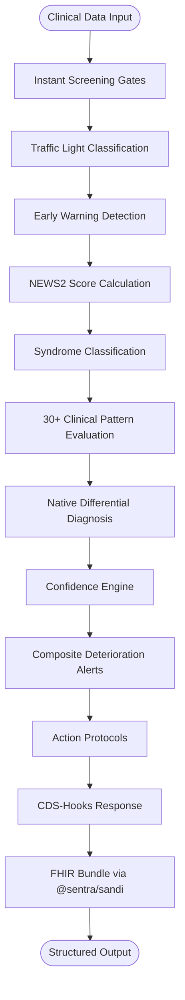
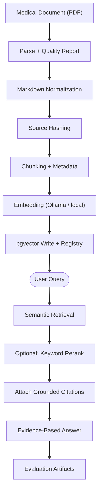
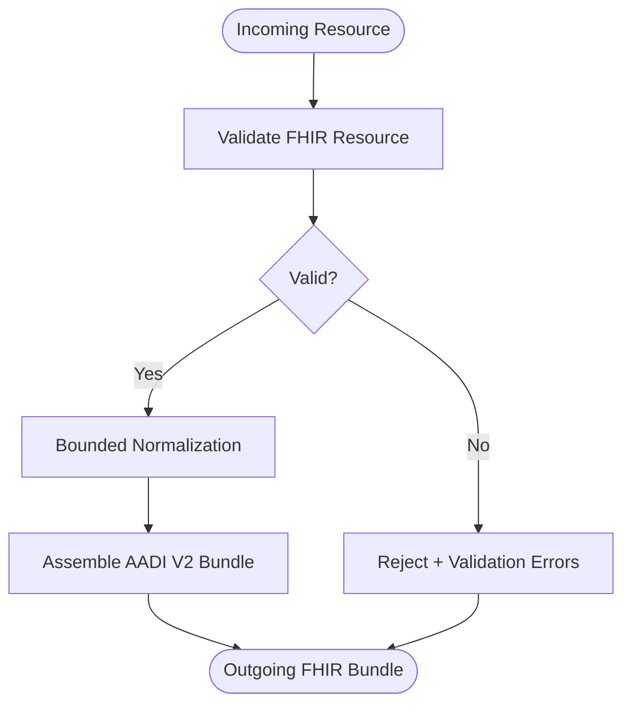
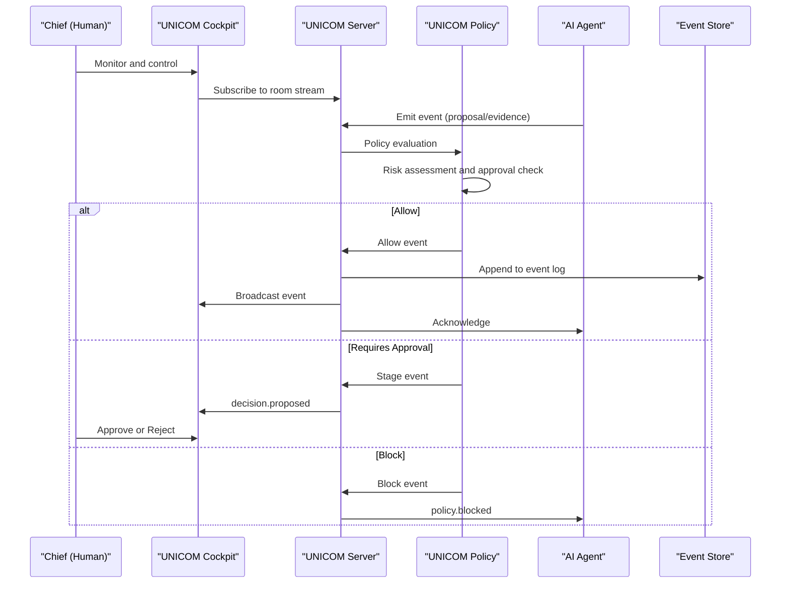
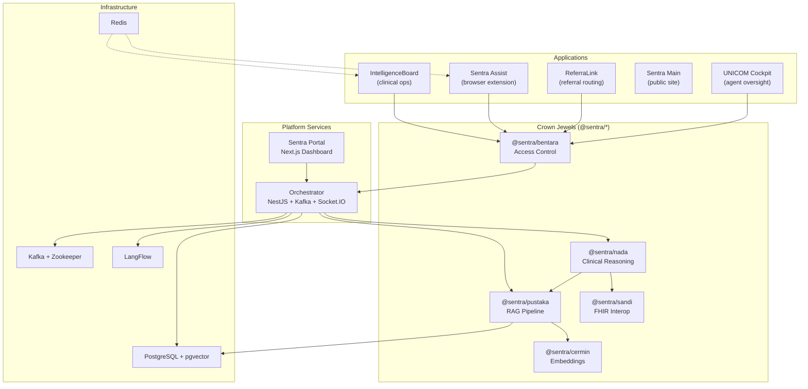

<div align="center">

# The Abyss

**Where clinical intelligence meets engineering discipline — AI-native
infrastructure that thinks _with_ the clinician, not behind them.**

_The single monorepo powering Sentra's healthcare AI ecosystem: crown-jewel
reasoning engines, retrieval-augmented knowledge, FHIR interoperability, agent
coordination, and governed multi-tenant deployment — all in one workspace._

</div>

---

## Overview

<table>
<tr>
<td valign="middle" width="180">
  
</td>
<td valign="top">

The Abyss is the production engineering workspace for **Sentra**, an AI-native
healthcare intelligence platform designed for Indonesian primary-care facilities
and the specialists who support them. It is not a chatbot bolted onto an EMR. It
is a boundary-enforced, governance-first monorepo where **crown-jewel AI
engines** — clinical reasoning (`@sentra/nada`), retrieval-augmented generation
(`@sentra/pustaka`), FHIR interoperability (`@sentra/sandi`), access control
(`@sentra/bentara`), and embedding infrastructure (`@sentra/cermin`) — coexist
with platform services, application surfaces, and an ABYSS-native agent
coordination subsystem (**UNICOM**) under a single pnpm workspace governed by
Turborepo.

Every package, every import boundary, every deployment artifact is subject to
taxonomy rules, crown-jewel isolation, and verifiable governance — because
healthcare AI demands engineering honesty, not marketing polish.

</td>
</tr>
</table>

---

<div align="center">


**Architect:** Dr. Ferdi Iskandar (Classy) · <drferdiiskandar@sentrahai.com>

> _"Healthcare AI that cannot explain its reasoning, cannot prove its
> provenance, and cannot be audited by a human — is not healthcare AI. It is a
> liability."_

</div>

---

## Why Sentra — Generic AI Platform vs. The Abyss

| Dimension               | Generic AI Platform           | The Abyss                                                                                                                                             |
| ----------------------- | ----------------------------- | ----------------------------------------------------------------------------------------------------------------------------------------------------- |
| **Clinical reasoning**  | LLM prompt + hope             | Deterministic pattern engine (`@sentra/nada`) with 30+ clinical patterns, NEWS2, traffic-light triage, confidence scoring, and CDS-Hooks export       |
| **Knowledge retrieval** | Vector DB + raw search        | Local-first RAG pipeline (`@sentra/pustaka`) with pgvector, citation grounding, knowledge registry, supersession, and evaluation artifacts            |
| **Interoperability**    | REST API, custom schema       | FHIR R4 validation and bundle projection (`@sentra/sandi`) targeting SatuSehat and CDS-Hooks contracts                                                |
| **Access control**      | Role-based at the gateway     | GO-gate enforcement (`@sentra/bentara`) with multi-tenant RBAC, tenant isolation, rate limiting, and audit logging at every engine boundary           |
| **Agent coordination**  | Third-party orchestration SDK | ABYSS-native UNICOM subsystem with room-based collaboration, policy-gated risk, human-in-the-loop approval, and append-only event store               |
| **Governance**          | README + good intentions      | `AGENTS.md` supreme instruction set, `.agent/` SSOT, `apps/_governance/` boundary classification, crown-jewel isolation tiers, orphan detection rules |
| **Build orchestration** | Ad-hoc scripts                | Turborepo 2.x with caching, dependency-aware pipelines, and pnpm workspace integrity                                                                  |
| **Clinical safety**     | "Don't hallucinate" (vibes)   | Explicit safety gates, uncertainty visibility, shadow comparison, explainability exports, and human-oversight enforcement                             |

---

## Executive Summary

- **Unified workspace** — 34 tracked workspace packages across apps, engines,
  platform, clinical, shared, tooling, and UNICOM subsystems in a single
  Turborepo-managed pnpm workspace.
- **Crown-jewel AI engines** — Five proprietary `@sentra/*` packages powering
  clinical reasoning, RAG, FHIR interop, access control, and embeddings.
- **Production orchestration** — NestJS orchestrator with CQRS/Saga patterns,
  Kafka event streaming, Socket.IO real-time, and LangFlow integration.
- **Governed agent coordination** — UNICOM subsystem providing room-based
  collaboration, policy-gated risk management, and human-in-the-loop oversight
  for AI agents.
- **Healthcare-grade interoperability** — FHIR R4 bundle generation, CDS-Hooks
  mapping, and SatuSehat-ready export.
- **Boundary-enforced architecture** — Package taxonomy rules, ESLint restricted
  imports, crown-jewel access tiers, and formal preflight for all app work.

### Who builds on The Abyss

| Persona                      | Role                                           | Pain Point Solved                                                                         |
| ---------------------------- | ---------------------------------------------- | ----------------------------------------------------------------------------------------- |
| **Primary-care physician**   | End user via IntelligenceBoard / Sentra Assist | AI-assisted diagnosis, emergency detection, and EMR automation at the point of care       |
| **Clinical informatician**   | CDSS integrator                                | FHIR/CDS-Hooks exports, retrieval evaluation pipelines, and auditable reasoning traces    |
| **Platform engineer**        | Infrastructure operator                        | Unified build, Docker Compose local stack, Kafka orchestration, and observability hooks   |
| **AI researcher**            | Engine contributor                             | Local-first RAG with pgvector, embedding evaluation, and knowledge registry management    |
| **Agent developer**          | UNICOM extension author                        | Typed protocol, policy SDK, room state reducers, and agent launcher with monitoring       |
| **Healthcare administrator** | Decision maker                                 | Clinical dashboards, referral analytics, telemedicine workflows, and compliance reporting |

---

## Table of Contents

1. [Features Overview](#features-overview)
2. [Quickstart](#quickstart)
3. [Detailed Features](#detailed-features)
4. [System Architecture](#system-architecture)
5. [Project Structure](#project-structure)
6. [API Reference](#api-reference)
7. [Security & Privacy](#security--privacy)
8. [Operations & Deployment](#operations--deployment)
9. [Developer Guide](#developer-guide)
10. [Assumptions & Open Questions](#assumptions--open-questions)
11. [Related Documentation](#related-documentation)
12. [License](#license)

---

## Features Overview

| #   | Feature                                                                                                                         | Status  | Primary User             |
| --- | ------------------------------------------------------------------------------------------------------------------------------- | ------- | ------------------------ |
| 1   | **Clinical Reasoning Engine** (`@sentra/nada`) — 30+ patterns, NEWS2, traffic-light triage, confidence scoring, CDS-Hooks       | ✅ Live | Clinical informatician   |
| 2   | **RAG Pipeline** (`@sentra/pustaka`) — PDF ingest, chunking, embedding, pgvector retrieval, citation grounding, evaluation      | ✅ Live | AI researcher            |
| 3   | **FHIR Interoperability** (`@sentra/sandi`) — R4 validation, bundle projection, normalization seam, R5 version strategy         | ✅ Live | Clinical informatician   |
| 4   | **Access Control** (`@sentra/bentara`) — GO-gate, multi-tenant RBAC, rate limiting, audit logging                               | ✅ Live | Platform engineer        |
| 5   | **Embedding Infrastructure** (`@sentra/cermin`) — Vector store abstraction, embedding provider, circuit breaker, citation views | ✅ Live | AI researcher            |
| 6   | **UNICOM Agent Coordination** — Room-based collaboration, policy-gated risk, human-in-the-loop, append-only event store         | ✅ Live | Agent developer          |
| 7   | **NestJS Orchestrator** — CQRS/Saga, Kafka events, Socket.IO, LangFlow integration, Swagger docs                                | ✅ Live | Platform engineer        |
| 8   | **IntelligenceBoard** — CDSS, EMR auto-fill (Playwright RPA), telemedicine, ICD-X lookup, LB1 reports                           | ✅ Live | Primary-care physician   |
| 9   | **Sentra Assist** — Browser extension with emergency detection, Iskandar diagnosis engine, DAS adaptive extraction              | ✅ Live | Primary-care physician   |
| 10  | **ReferraLink** — AI-assisted referral routing, semantic cache, diagnosis endpoint                                              | ✅ Live | Healthcare administrator |
| 11  | **Document Ingestion** — Parser providers, OCR quality, markdown normalization, source hashing                                  | ✅ Live | AI researcher            |
| 12  | **LangFlow Integration** — TypeScript client for programmatic flow execution                                                    | ✅ Live | Platform engineer        |
| 13  | **Sentra Portal** — Next.js dashboard and mission control interface                                                             | ✅ Live | Healthcare administrator |
| 14  | **Literature Harvester** — Open-access literature collection and ingestion tooling                                              | ✅ Live | AI researcher            |
| 15  | **Integration Bridge** — External system connectivity (Notion, Linear)                                                          | ✅ Live | Platform engineer        |
| 16  | **Abyss CLI** — Task init, GO flow, status, scaffolding, flow sync                                                              | ✅ Live | Developer                |
| 17  | **Design System** — Shared UI components, design tokens, typography, spacing                                                    | ✅ Live | Frontend developer       |
| 18  | **Flow Definitions** — LangFlow definitions for healthcare, academic, and platform workflows                                    | ✅ Live | Platform engineer        |

---

## Quickstart

### Prerequisites

| Requirement             | Minimum Version | Purpose              |
| ----------------------- | --------------- | -------------------- |
| Node.js                 | 22.0.0          | Runtime              |
| pnpm                    | 9.15.0          | Package manager      |
| Docker & Docker Compose | Latest          | Local infrastructure |
| Git                     | Latest          | Version control      |

### Installation

```bash
git clone https://github.com/drclassy/abyss-monorepo.git
cd abyss-monorepo
pnpm install
```

> **Windows note:** If `pnpm install` fails on drives without copy-on-write
> support, use: `pnpm install --package-import-method=copy`

### Environment Variables

Copy `.env.example` to `.env` and configure:

| Variable              | Purpose                                            |
| --------------------- | -------------------------------------------------- |
| `NODE_ENV`            | Runtime environment (`development` / `production`) |
| `DATABASE_URL`        | PostgreSQL connection string                       |
| `LANGFLOW_API_URL`    | LangFlow inference endpoint                        |
| `OPENAI_API_KEY`      | OpenAI API key for LLM integration                 |
| `ANTHROPIC_API_KEY`   | Anthropic API key for Claude models                |
| `CLASSY_PLUS_API_KEY` | Classy Plus clinical API key                       |

> ⚠️ **Never commit real credentials.** Always use placeholders in examples.

### Local Infrastructure

```bash
cd infrastructure/docker
docker-compose up -d
```

This starts: PostgreSQL, Kafka + Zookeeper, Redis, LangFlow, and the
Orchestrator.

### Run

```bash
# Full workspace development servers
pnpm dev

# Build all packages
pnpm build

# Typecheck entire workspace
pnpm typecheck

# Run all tests
pnpm test
```

---

## Detailed Features

### Clinical Reasoning Engine (`@sentra/nada`)

The clinical reasoning engine processes patient data through 30+ deterministic
clinical patterns, producing differential diagnoses with confidence scores,
traffic-light triage classifications, and actionable recommendations — all
exportable to FHIR and CDS-Hooks formats.



**Key capabilities:**

| Capability              | Description                                                         |
| ----------------------- | ------------------------------------------------------------------- |
| Composite deterioration | Multi-vital sign deterioration scoring                              |
| NEWS2                   | National Early Warning Score 2 calculation                          |
| Traffic-light triage    | Red / Amber / Green classification with safety gates                |
| Clinical patterns       | 30+ pattern evaluations including syndromes and disease classifiers |
| Confidence engine       | Per-diagnosis confidence scoring with explainability                |
| Shadow comparison       | Parallel deterministic vs. LLM reasoning for validation             |
| CDS-Hooks mapping       | Standardized FHIR service definitions and bundle assembly           |

### RAG Pipeline (`@sentra/pustaka`)

Local-first retrieval-augmented generation pipeline for medical knowledge.
Documents are ingested, chunked, embedded via local providers, stored in
pgvector, and retrieved with citation grounding for auditable, evidence-based
answers.



**Key capabilities:**

| Capability           | Description                                                  |
| -------------------- | ------------------------------------------------------------ |
| Ingestion pipeline   | PDF parsing, chunking, quality scoring, dry-run mode         |
| Embedding            | Ollama + Gemma with retry, circuit breaker, and guard engine |
| pgvector storage     | IVFFlat-indexed vector writes with pool adapter              |
| Knowledge registry   | Tracking, eligibility gating, supersession management        |
| Hybrid retrieval     | Vector + keyword for Indonesia-aware medical terms           |
| Evaluation pipeline  | Retrieval evaluation, evidence validation, quality scoring   |
| Literature connector | Harvested literature ingestion from open-access sources      |

### FHIR Interoperability (`@sentra/sandi`)

Bounded FHIR R4 structural validation and normalization seam. Validates Patient,
Observation, Condition, RiskAssessment, and DiagnosticReport resources,
assembles AADI V2 FHIR bundles, and provides a version strategy toward R5.



### UNICOM Agent Coordination

ABYSS-native subsystem for real-time AI agent communication with human
oversight. Provides room-based collaboration, policy-gated risk management, and
append-only event sourcing.



**Operating modes:** Observe, Collaborative, Approval-gated, Autonomous-safe,
Clinical-safety, Freeze.

| Package                         | Path                          | Role                                                  |
| ------------------------------- | ----------------------------- | ----------------------------------------------------- |
| `@the-abyss/unicom-core`        | `packages/unicom/core`        | Typed protocol, event contracts, reducers, room state |
| `@the-abyss/unicom-policy`      | `packages/unicom/policy`      | Boundary and approval rules for risky agent actions   |
| `@the-abyss/unicom-agent-sdk`   | `packages/unicom/agent-sdk`   | Agent client, launcher, transport, monitoring         |
| `@the-abyss/unicom-server`      | `packages/unicom/server`      | Local realtime server and service runtime             |
| `@the-abyss/unicom-client`      | `packages/unicom/client`      | UI/runtime client for cockpit and integrations        |
| `@the-abyss/unicom-persistence` | `packages/unicom/persistence` | Append-only Postgres persistence scaffolding          |
| `@the-abyss/unicom-testkit`     | `packages/unicom/testkit`     | Fixtures and fake transport for contract tests        |

### IntelligenceBoard

Full-stack clinical operations platform for Indonesian primary healthcare
(`puskesmas`). Integrates CDSS, telemedicine, EMR automation, and real-time
observability.

| Feature               | Description                                         |
| --------------------- | --------------------------------------------------- |
| EMR auto-fill         | Playwright RPA with Socket.IO streaming progress    |
| ICD-X lookup          | Multi-version support with fuzzy search             |
| LB1 report automation | Validation, mapping, and output generation pipeline |
| Telemedicine          | WebRTC with STUN/TURN, AI-generated SOAP notes      |
| ACARS messaging       | Real-time internal chat events                      |
| CDSS diagnosis        | Deterministic + LLM reasoning with safety gates     |
| Clinical trajectory   | NEWS2 early warning, disease classifiers            |
| Crew access portal    | HMAC-signed session cookies, rate limiting          |

### Sentra Assist

Browser extension connecting ePuskesmas to AI-powered CDSS. Built with WXT
MV3/MV2.

| Feature                 | Description                                                      |
| ----------------------- | ---------------------------------------------------------------- |
| Emergency detection     | 4 gates: TTV inference, HTN crisis, Glucose crisis, occult shock |
| Iskandar diagnosis      | 8-step pipeline, traffic-light safety gate, ICD-10 validation    |
| DAS adaptive extraction | Confidence scoring, self-healing remapping                       |
| RME transfer            | Orchestrator with retry, dedup, dashboard bridge sync            |
| PII anonymization       | Dashboard-backed authentication and audit trail                  |

---

## System Architecture



### Deployment Recommendation

| Component    | Strategy                            | Scaling                         |
| ------------ | ----------------------------------- | ------------------------------- |
| Orchestrator | Stateless pods behind load balancer | HPA on CPU + Kafka consumer lag |
| PostgreSQL   | Managed instance (Neon / RDS)       | Read replicas for retrieval     |
| Kafka        | 3-broker cluster                    | Partition per flow type         |
| Redis        | Cluster mode for cache              | Horizontal scaling              |
| LangFlow     | Container per worker                | Scale on inference demand       |
| Applications | Vercel / Docker per app             | Independent scaling             |

---

## Project Structure

```
abyss-monorepo/
├── apps/                          # Deployable applications
│   ├── healthcare/
│   │   ├── intelligenceboard/     # Clinical ops platform (Next.js 16)
│   │   ├── sentra-assist/         # Browser extension (WXT MV3/MV2)
│   │   ├── sentra-main/           # Public marketing site (Next.js)
│   │   ├── referralink/           # Referral routing (Next.js)
│   │   └── primary-healthcare/    # Puskesmas website + DB
│   ├── academic/
│   │   ├── clinical-simulator/    # AI clinical-case training
│   │   └── evaluation-engine/     # Competency assessment
│   ├── community/
│   │   ├── classy-transformer/    # Multi-provider LLM workspace
│   │   └── classy-memory/         # Memory runtime (TS + Python)
│   ├── corporate/
│   │   └── ferdiiskandar/         # Corporate website (Next.js 15)
│   ├── internal/
│   │   └── unicom/                # UNICOM operator cockpit
│   └── _governance/               # Boundary classification and preflight
├── packages/
│   ├── sentra/                    # Crown-jewel engines (review-first)
│   │   ├── sentra-nada/           # Clinical reasoning + CDS-Hooks
│   │   ├── sentra-pustaka/        # RAG pipeline + pgvector
│   │   ├── sentra-sandi/          # FHIR interoperability
│   │   ├── sentra-bentara/        # Access control + GO-gate
│   │   └── sentra-cermin/         # Embeddings + vector store
│   ├── unicom/                    # UNICOM coordination subsystem
│   │   ├── core/                  # Protocol, events, reducers
│   │   ├── policy/                # Boundary and approval rules
│   │   ├── agent-sdk/             # Agent launcher and transport
│   │   ├── server/                # Realtime server runtime
│   │   ├── client/                # UI/runtime client
│   │   ├── persistence/           # Append-only Postgres persistence
│   │   └── testkit/               # Contract test fixtures
│   ├── platform/                  # Runtime infrastructure
│   │   ├── database/              # Prisma client + schema
│   │   ├── document-ingestion/    # Parser + OCR + normalization
│   │   ├── langflow-client/       # LangFlow API client
│   │   └── literature-harvester/  # Open-access harvesting
│   ├── clinical/
│   │   └── clinical-references/   # Clinical reference data
│   ├── shared/                    # Low-level primitives
│   │   ├── sentra-ui/             # Shared UI components
│   │   ├── design-token/          # Design tokens
│   │   └── shared-types/          # Cross-workspace TS contracts
│   ├── tooling/
│   │   ├── config-eslint/         # Shared ESLint presets
│   │   └── config-typescript/     # Shared TS config
│   └── integration/               # External integrations bridge
├── platform/
│   ├── orchestrator/              # NestJS orchestrator (CQRS + Kafka)
│   └── sentra-portal/             # Next.js dashboard
├── flows/definitions/             # LangFlow workflow definitions
│   ├── healthcare/                # Healthcare flows
│   ├── academic/                  # Academic flows
│   └── platform/                  # Platform orchestration flows
├── infrastructure/
│   ├── docker/                    # Dockerfiles + docker-compose
│   ├── argocd/                    # GitOps manifests
│   └── terraform/                 # Legacy IaC (under retirement)
├── tooling/
│   ├── abyss-cli/                 # Monorepo CLI
│   ├── governance/                # Compliance and validation
│   ├── prompt-engine/             # Prompt composer
│   ├── handbook/                  # VS Code handbook launcher
│   ├── librarian-desktop/         # Electron literature worker
│   └── scripts/                   # Governance + maintenance scripts
├── docs/                          # Architecture, guides, specs, ADRs
│   ├── unicom/                    # UNICOM subsystem documentation
│   ├── adr/                       # Architectural decision records
│   ├── guides/                    # Active guides and onboarding
│   └── specs/                     # Specifications and contracts
├── .agent/                        # Protected SSOT (governance memory)
├── AGENTS.md                      # Supreme repo instruction set
├── pnpm-workspace.yaml            # Workspace membership authority
└── turbo.json                     # Turborepo pipeline configuration
```

---

## API Reference

### Orchestrator REST API

| Method | Endpoint                     | Module  | Description                              |
| ------ | ---------------------------- | ------- | ---------------------------------------- |
| `POST` | `/flows/:flowId/run`         | Flows   | Execute an AI flow via Saga Orchestrator |
| `GET`  | `/flows/:executionId/status` | Flows   | Get saga execution status                |
| `GET`  | `/health`                    | Health  | Health check (readiness/liveness)        |
| `GET`  | `/docs`                      | Swagger | Interactive API documentation            |

### Sentra Portal APIs

| Namespace | Path                    | Description                            |
| --------- | ----------------------- | -------------------------------------- |
| RAG       | `/api/portal/rag/*`     | Knowledge retrieval and ingestion      |
| SSOT      | `/api/portal/ssot/*`    | Single source of truth synchronization |
| Context   | `/api/portal/context/*` | Context management for AI sessions     |
| Ops       | `/api/portal/ops/*`     | Operational commands and status        |
| Prompt    | `/api/portal/prompt/*`  | Prompt composition and management      |
| Verify    | `/api/portal/verify/*`  | Verification and validation endpoints  |
| Summary   | `/api/portal/summary/*` | Clinical summary generation            |
| UNICOM    | `/api/portal/unicom/*`  | Agent coordination and room management |

### Authentication

All orchestrator endpoints require `x-api-key` header. Swagger UI supports
Bearer Auth. Application-level auth uses HMAC-signed session cookies with
`HttpOnly`, `Secure`, and `SameSite=Strict` flags.

---

## Security & Privacy

| Dimension                 | Implementation                                                              |
| ------------------------- | --------------------------------------------------------------------------- |
| **Authentication**        | HMAC-signed session cookies, API key guards, Bearer tokens                  |
| **Authorization**         | Multi-tenant RBAC via `@sentra/bentara` GO-gate enforcement                 |
| **Tenant isolation**      | Per-tenant scoping at every engine boundary                                 |
| **Rate limiting**         | Per-tenant rate limits at the gateway layer                                 |
| **Audit logging**         | All requests logged; UNICOM append-only event store for agent actions       |
| **PHI protection**        | No PHI in Kafka DLQ topics; PII anonymization in Sentra Assist              |
| **Crown-jewel isolation** | `@sentra/*` packages require explicit approval for edits                    |
| **Secret management**     | `.env` values never committed; `.env.example` with placeholders only        |
| **Clinical safety**       | Human-in-the-loop enforcement, uncertainty visibility, shadow comparison    |
| **Dependency security**   | pnpm overrides for known vulnerabilities (minimatch, rollup, esbuild, xlsx) |

> ⚠️ **Clinical Disclaimer:** All AI-generated clinical outputs require human
> review before patient-facing use. The system surfaces uncertainty and
> confidence scores to support — never replace — clinical judgment.

---

## Operations & Deployment

### Local Stack

```bash
cd infrastructure/docker
docker-compose up -d
```

| Service      | Port | Purpose                     |
| ------------ | ---- | --------------------------- |
| PostgreSQL   | 5432 | Primary database + pgvector |
| Kafka        | 9092 | Event streaming             |
| Zookeeper    | 2181 | Kafka coordination          |
| Redis        | 6379 | Cache layer                 |
| LangFlow     | 7860 | AI inference engine         |
| Orchestrator | 3001 | NestJS API + Swagger        |

### CI/CD

- GitHub Actions workflows under `.github/workflows/`
- ArgoCD GitOps manifests under `infrastructure/argocd/`
- Docker multi-stage builds with `APP_NAME` build argument

### Observability

| Tool             | Purpose                                               |
| ---------------- | ----------------------------------------------------- |
| Langfuse         | LLM observability and trace analysis                  |
| Sentry           | Error tracking and performance monitoring             |
| Kafka DLQ topics | Failure diagnostics (`diagnosis-dlq`, `referral-dlq`) |
| Health endpoints | `/health` readiness and liveness probes               |

---

## Developer Guide

### Commands

```bash
# Development
pnpm dev                    # Start all development servers
pnpm build                  # Build all packages
pnpm test                   # Run all tests
pnpm lint                   # Lint all workspaces
pnpm format                 # Format with Prettier
pnpm typecheck              # Typecheck entire workspace

# Database
pnpm db:generate            # Generate Prisma client
pnpm db:push                # Push schema to database
pnpm db:migrate             # Run database migrations
pnpm db:studio              # Open Prisma Studio

# Governance
pnpm governance:agents-check  # Agent health validation

# CLI
pnpm abyss init-task "Describe the task"
pnpm abyss go .agent/sessions/YYYY-MM-DD --by "Chief"
pnpm abyss status
```

### Commit Convention

Pre-commit hooks run via Husky + lint-staged:

- TypeScript files: ESLint fix + Prettier
- JavaScript files: Prettier
- JSON/Markdown/YAML: Prettier

### Adding a Package

Agents must not create packages directly under `packages/*`. Allowed locations:

| Path                  | Purpose                              |
| --------------------- | ------------------------------------ |
| `packages/sentra/*`   | Proprietary crown-jewel capabilities |
| `packages/unicom/*`   | Agent communication and coordination |
| `packages/platform/*` | Runtime infrastructure               |
| `packages/clinical/*` | Clinical knowledge and safety        |
| `packages/shared/*`   | Low-level primitives                 |
| `packages/tooling/*`  | Developer and build tooling          |

If classification is unclear, stop and request Chief decision.

---

## Assumptions & Open Questions

### Assumptions

| Assumption                                            | Impact if Wrong                                                  |
| ----------------------------------------------------- | ---------------------------------------------------------------- |
| PostgreSQL is available for pgvector operations       | RAG pipeline fails silently; retrieval returns empty             |
| Kafka broker is reachable for orchestrator            | Flow events are lost; saga state cannot progress                 |
| Ollama is available for local embeddings              | Embedding falls back to remote provider; higher latency and cost |
| ePuskesmas DOM structure is stable for Playwright RPA | EMR auto-fill breaks; requires DAS remmapping                    |
| FHIR R4 resources conform to published profiles       | Sandi validation rejects valid clinical data                     |

### Open Questions

1. **Branch authority normalization** — Protected-branch rollout and
   required-check mapping are not yet complete across local state, workflows,
   and remote metadata.
2. **Package naming normalization** — `packages/integration` carries legacy
   package identity `@the-abyss/integration-bridge`; explicit decision pending.
3. **Terraform retirement** — Legacy Terraform modules remain in-tree; timeline
   for complete removal not yet committed.
4. **UNICOM persistence** — Append-only Postgres scaffolding exists; production
   persistence strategy needs final validation.
5. **App boundary push scope** — Final list of which app packages are part of
   the public monorepo push surface is still being normalized.

---

## Related Documentation

| Document          | Path                                                                                       | Description                                        |
| ----------------- | ------------------------------------------------------------------------------------------ | -------------------------------------------------- |
| Repository Rules  | [`AGENTS.md`](AGENTS.md)                                                                   | Supreme instruction set and architecture authority |
| Active SSOT       | [`.agent/README.md`](.agent/README.md)                                                     | Governance memory and handoff surfaces             |
| Contributor Guide | [`CONTRIBUTING.md`](CONTRIBUTING.md)                                                       | Workflow and change flow                           |
| Security Policy   | [`SECURITY.md`](SECURITY.md)                                                               | Vulnerability reporting                            |
| Docs Index        | [`docs/README.md`](docs/README.md)                                                         | Architecture, guides, specs                        |
| UNICOM Spec       | [`docs/unicom/SENTRA_UNICOM_SPEC.md`](docs/unicom/SENTRA_UNICOM_SPEC.md)                   | UNICOM scope and protocol                          |
| UNICOM Safety     | [`docs/unicom/UNICOM_SAFETY_BOUNDARY.md`](docs/unicom/UNICOM_SAFETY_BOUNDARY.md)           | Safety rules and boundaries                        |
| ADR Index         | [`docs/adr/`](docs/adr/)                                                                   | Architectural decision records                     |
| Smart Push Guide  | [`docs/guides/007-smart-push-and-merge.md`](docs/guides/007-smart-push-and-merge.md)       | Push and merge best practices                      |
| Workspace Setup   | [`docs/guides/002-workspace-setup.md`](docs/guides/002-workspace-setup.md)                 | Workspace configuration                            |
| App Governance    | [`apps/_governance/APP_BOUNDARY_PREFLIGHT.md`](apps/_governance/APP_BOUNDARY_PREFLIGHT.md) | Boundary classification preflight                  |

---

## License

| Who You Are                 | License                                                                                                                  |
| --------------------------- | ------------------------------------------------------------------------------------------------------------------------ |
| **Community / open-source** | [Apache License 2.0](LICENSE) — use, modify, distribute freely with attribution and patent grant                         |
| **Commercial use**          | Apache 2.0 — no separate commercial license required                                                                     |
| **Trademark**               | "Sentra" and "The Abyss" names are not covered by the license; contact <drferdiiskandar@sentrahai.com> for trademark use |

---

<div align="center">

**Version:** 0.0.1 **Last updated:** 2026-05-28

_Engineering honesty in healthcare AI — one governed commit at a time._

</div>
