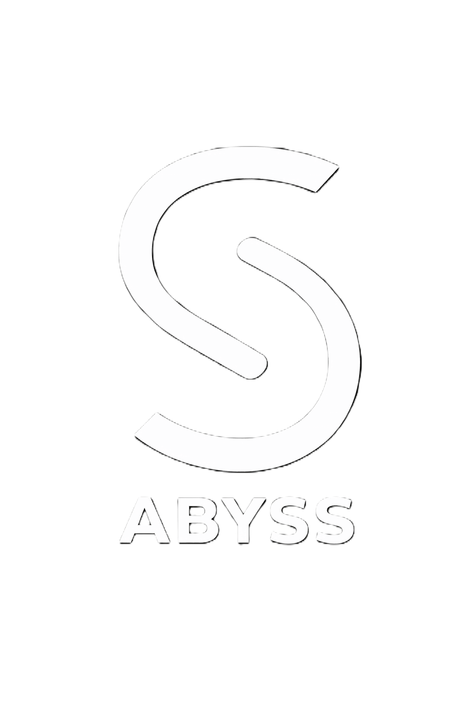

# The Abyss

**AI-native monorepo for the Sentra Healthcare AI ecosystem**

[](https://nodejs.org)
[](https://pnpm.io)
[](https://www.typescriptlang.org)
[](https://turbo.build/repo)

---

## Overview

<table>
<tr>
<td valign="middle" width="180">
  
</td>
<td valign="top">

The Abyss is the current engineering workspace for Sentra's healthcare
intelligence platform. It contains the core Sentra packages, ABYSS-native UNICOM
agent coordination, shared data and design packages, platform services, tooling,
infrastructure definitions, governance rules, and selected application surfaces
in a single pnpm workspace.

This README is reality-first. It reflects the repository as it exists now in
`pnpm-workspace.yaml` and the actual folder tree. It is not a historical
brochure, and it does not hide legacy, partial, or under-retirement surfaces.

</td>
</tr>
</table>

---

## Source of truth

- Workspace membership: [`pnpm-workspace.yaml`](pnpm-workspace.yaml)
- Repository rules and architecture: [`AGENTS.md`](AGENTS.md)
- Active agent continuity SSOT: [`.agent/README.md`](.agent/README.md) and
  [`.agent/HANDOFF.md`](.agent/HANDOFF.md)
- Current progress and decisions: [`.agent/PROGRESS.md`](.agent/PROGRESS.md) and
  [`.agent/DECISIONS.md`](.agent/DECISIONS.md)
- Current docs index: [`docs/README.md`](docs/README.md)
- Current UNICOM subsystem docs: [`docs/unicom/`](docs/unicom/)

Public docs should mirror committed repo behavior without exposing private
session or report records from `.agent/`.

---

## Contributing and change flow

- Contributor workflow: [`CONTRIBUTING.md`](CONTRIBUTING.md)
- Security reporting: [`SECURITY.md`](SECURITY.md)
- Smart push and merge guide:
  [`docs/guides/007-smart-push-and-merge.md`](docs/guides/007-smart-push-and-merge.md)

Branch authority normalization is still pending. The repo currently shows mixed
branch signals across local state, workflows, and remote metadata, so final
protected-branch rollout and required-check mapping are not complete yet.

---

## Current status

Current verified baseline from the active `.agent/` SSOT:

- Root `pnpm typecheck -- --pretty false`: `PASS`
- Root `pnpm build`: `PASS`
- Root `pnpm test`: `PASS`

Important repository state:

- This checkout has 34 tracked workspace package manifests, excluding the root
  package: 2 app packages, 25 package-layer manifests, 2 platform manifests, and
  5 tooling manifests.
- Workspace membership is defined by `pnpm-workspace.yaml`; public push scope is
  additionally constrained by `.gitignore` and app boundary governance.
- `packages/integration` is the on-disk folder for package identity
  `@the-abyss/integration-bridge`; any naming normalization remains a future
  explicit decision.
- `packages/sentra/**` contains the crown-jewel Sentra engines and remains
  review-first territory requiring explicit approval before edits.
- `apps/` is not bulk-included as a public surface. Only explicit governance
  files and approved retained app packages are intended to be pushed from this
  monorepo checkout.
- Sentra UNICOM is now the active ABYSS-native coordination subsystem under
  `docs/unicom/**`, `packages/unicom/*`, and `apps/internal/unicom`.

---

## Repository control surfaces

| Surface             | Path                 | Role                                                                |
| ------------------- | -------------------- | ------------------------------------------------------------------- |
| `AGENTS.md`         | `AGENTS.md`          | Supreme repo instruction set and architectural authority.           |
| `CLAUDE.md`         | `CLAUDE.md`          | Claude Code CLI entry surface.                                      |
| `.agent`            | `.agent/`            | Tracked governance memory and active handoff surfaces.              |
| `.claude`           | `.claude/`           | Local-only Claude Code configuration and skills support.            |
| `.qoder`            | `.qoder/`            | Local-only Qoder IDE agent configuration and generated repo-wiki.   |
| `.cursor`           | `.cursor/`           | Shared Cursor rules, tracked subagents, and IDE behavior surfaces.  |
| `.mcp.json`         | `.mcp.json`          | Local-only MCP registry when present on disk.                       |
| `mcp.json.example`  | `mcp.json.example`   | Committed MCP template for local setup.                             |
| `.github/workflows` | `.github/workflows/` | CI, automation, docs guard, security, and reusable agent workflows. |

---

## Current stack

| Layer               | Current stack                                                             |
| ------------------- | ------------------------------------------------------------------------- |
| Runtime             | Node >= 22, pnpm 9.15.0, Turborepo 2.x                                    |
| Frontend            | Next.js 15/16, React 18/19, Tailwind CSS 3/4                              |
| Backend             | NestJS 11, Next.js route handlers, Node/TypeScript services               |
| Database            | PostgreSQL via Prisma in `packages/platform/database`                     |
| AI orchestration    | LangFlow + local-first inference + OpenAI + Anthropic + DeepSeek          |
| Retrieval           | pgvector + local embeddings + `@sentra/pustaka` + `@sentra/cermin`        |
| Agent coordination  | Sentra UNICOM packages, local realtime server, client, policy, and SDK    |
| Messaging and cache | Kafka, Zookeeper, Redis                                                   |
| Infra               | Docker, Docker Compose, ArgoCD, Terraform legacy modules under retirement |
| Testing             | Vitest, Playwright, selected legacy Jest surfaces                         |

---

## Monorepo inventory

### Applications

`apps/` is a curated portfolio boundary, not a blanket public-push surface. The
tracked app package manifests in this checkout are:

| Workspace                  | Path                           | Role                                                                 |
| -------------------------- | ------------------------------ | -------------------------------------------------------------------- |
| `@the-abyss/ferdiiskandar` | `apps/corporate/ferdiiskandar` | Personal brand and corporate-facing website surface.                 |
| `@the-abyss/unicom`        | `apps/internal/unicom`         | Internal UNICOM cockpit for agent rooms, evidence, and intervention. |

Tracked app governance remains under `apps/AGENTS.md`, `apps/_governance/**`,
and approved `app.boundary.json` manifests. Other app projects may exist on
local workstations, but they are not automatically part of the public monorepo
push surface.

For any future app work, read `apps/AGENTS.md` and
`apps/_governance/APP_BOUNDARY_PREFLIGHT.md` before implementation.

### Platform

| Workspace                 | Path                     | Role                                                              |
| ------------------------- | ------------------------ | ----------------------------------------------------------------- |
| `@the-abyss/orchestrator` | `platform/orchestrator`  | NestJS 11 orchestration runtime with CQRS, Kafka, and Socket.IO.  |
| `sentra-portal`           | `platform/sentra-portal` | Portal and dashboard surface for platform or clinical visibility. |

---

## Shared engines and packages

| Package                           | Path                                     | Role                                                                                                                                                                                                                        |
| --------------------------------- | ---------------------------------------- | --------------------------------------------------------------------------------------------------------------------------------------------------------------------------------------------------------------------------- |
| `@the-abyss/clinical-references`  | `packages/clinical/clinical-references`  | Shared clinical reference types and structured clinical data surfaces.                                                                                                                                                      |
| `@the-abyss/config-eslint`        | `packages/tooling/config-eslint`         | Shared ESLint flat-config presets and repo lint boundaries.                                                                                                                                                                 |
| `@the-abyss/config-typescript`    | `packages/tooling/config-typescript`     | Shared TypeScript configuration presets across workspaces.                                                                                                                                                                  |
| `@the-abyss/database`             | `packages/platform/database`             | Prisma client, schema, and shared database access layer.                                                                                                                                                                    |
| `@the-abyss/design-token`         | `packages/shared/design-token`           | Sentra design tokens for color, borders, typography, and spacing.                                                                                                                                                           |
| `@the-abyss/document-ingestion`   | `packages/platform/document-ingestion`   | Canonical document ingestion surface with parsing, OCR-quality reporting, normalization, and source hashing.                                                                                                                |
| `@sentra/sandi`                   | `packages/sentra/sentra-sandi`           | FHIR validation, normalization, bundle projection, and interoperability engine.                                                                                                                                             |
| `@the-abyss/integration-bridge`   | `packages/integration`                   | Bridge layer for external integrations such as Notion and Linear. Current on-disk path is `packages/integration`; package identity remains `@the-abyss/integration-bridge` until an explicit naming-normalization decision. |
| `@sentra/bentara`                 | `packages/sentra/sentra-bentara`         | GO-gate and access-control enforcement surface.                                                                                                                                                                             |
| `@the-abyss/langflow-client`      | `packages/platform/langflow-client`      | TypeScript client for LangFlow API integration and flow execution.                                                                                                                                                          |
| `@the-abyss/literature-harvester` | `packages/platform/literature-harvester` | Open-access literature harvesting and collection tooling.                                                                                                                                                                   |
| `@sentra/pustaka`                 | `packages/sentra/sentra-pustaka`         | Sentra RAG engine for local-first medical knowledge retrieval, ingestion, evaluation, and pgvector-backed evidence lookup.                                                                                                  |
| `@the-abyss/ui`                   | `packages/shared/sentra-ui`              | Shared Sentra UI component layer.                                                                                                                                                                                           |
| `@the-abyss/shared-types`         | `packages/shared/shared-types`           | Cross-workspace TypeScript contracts and shared domain types.                                                                                                                                                               |
| `@sentra/nada`                    | `packages/sentra/sentra-nada`            | Clinical reasoning and orchestration layer with FHIR and CDS Hooks interoperability.                                                                                                                                        |
| `@sentra/cermin`                  | `packages/sentra/sentra-cermin`          | Embedding-provider, ingest, and vector-store support utilities for retrieval workflows.                                                                                                                                     |

### Sentra UNICOM packages

UNICOM is the ABYSS-native agent communication subsystem. It is owned under
`packages/unicom/*`, with docs under `docs/unicom/` and the cockpit under
`apps/internal/unicom`.

| Package                         | Path                          | Role                                                       |
| ------------------------------- | ----------------------------- | ---------------------------------------------------------- |
| `@the-abyss/unicom-core`        | `packages/unicom/core`        | Typed protocol, event contracts, reducers, and room state. |
| `@the-abyss/unicom-policy`      | `packages/unicom/policy`      | Boundary and approval rules for risky agent actions.       |
| `@the-abyss/unicom-agent-sdk`   | `packages/unicom/agent-sdk`   | Agent client, launcher, transport, and monitoring helpers. |
| `@the-abyss/unicom-testkit`     | `packages/unicom/testkit`     | Fixtures and fake transport for contract tests.            |
| `@the-abyss/unicom-server`      | `packages/unicom/server`      | Local realtime server and service runtime.                 |
| `@the-abyss/unicom-client`      | `packages/unicom/client`      | UI/runtime client for the cockpit and integrations.        |
| `@the-abyss/unicom-persistence` | `packages/unicom/persistence` | Append-only Postgres persistence scaffolding.              |

### Engine focus

These are the engine surfaces most central to current AI behavior in the repo:

- `@sentra/pustaka`
- `@sentra/nada`
- `@sentra/sandi`
- `@sentra/cermin`
- `@the-abyss/unicom-core`
- `@the-abyss/unicom-policy`
- `@the-abyss/unicom-server`
- `@the-abyss/langflow-client`
- `@sentra/bentara`
- `@the-abyss/database`

## Package Taxonomy Rule

Agents must not create new packages directly under `packages/*`.

Allowed package locations:

- `packages/sentra/*` for proprietary Sentra crown-jewel capabilities
- `packages/unicom/*` for ABYSS-native agent communication and coordination
- `packages/platform/*` for runtime infrastructure
- `packages/clinical/*` for clinical knowledge and safety substrate
- `packages/shared/*` for low-level primitives
- `packages/tooling/*` for developer and build tooling

If classification is unclear, stop and request Chief decision before creating a
package.

### AI capability map

#### Core engines

| Surface                         | Current capability                                                                                                                                                            |
| ------------------------------- | ----------------------------------------------------------------------------------------------------------------------------------------------------------------------------- |
| `@sentra/pustaka`               | Canonical local-first RAG runtime for PDF ingest, chunking, embedding, pgvector writes, retrieval, registry tracking, supersession, and retrieval evaluation artifacts.       |
| `@sentra/nada`                  | Clinical reasoning engine for assessment, clinical-pattern processing, confidence scoring, trajectory logic, safety gates, and interoperability export to FHIR and CDS Hooks. |
| `@sentra/cermin`                | Retrieval-side embedding and vector helper surface used to support local semantic search and document ingest helpers.                                                         |
| `@the-abyss/document-ingestion` | Canonical document front door with parser providers, OCR quality checks, markdown normalization, canonical document rendering, and source hashing.                            |
| `@the-abyss/langflow-client`    | Programmatic LangFlow API client for orchestrated flow execution from TypeScript runtimes.                                                                                    |
| `@sentra/sandi`                 | Clinical interoperability layer for FHIR bundle generation, transformation, validation hooks, and version strategy.                                                           |

#### Healthcare AI applications

| Surface                     | Current capability                                                                                                                                                          |
| --------------------------- | --------------------------------------------------------------------------------------------------------------------------------------------------------------------------- |
| `@classy/intelligenceboard` | CDSS routes, consult APIs, telemedicine workflows, Audrey voice surfaces, trajectory analytics, EMR bridge, clinical reports, and safety/observability hooks.               |
| `@the-abyss/sentra-assist`  | Iskandar diagnosis engine, emergency detector, ICD and RAG support, bridge/platform API clients, sidepanel CDSS widgets, and workflow automation for browser-assisted care. |
| `@the-abyss/referralink`    | Referral routing plus diagnosis endpoint, embedding-driven semantic cache, and memory-service helpers for contextual operations.                                            |

#### Community AI surfaces

| Surface                            | Current capability                                                                                                                  |
| ---------------------------------- | ----------------------------------------------------------------------------------------------------------------------------------- |
| `@the-abyss/classy-transformer`    | Multi-provider LLM workspace with provider registry, embeddings, transform engine, and recommendation API surfaces.                 |
| `@the-abyss/classy-memory`         | Community memory runtime with TypeScript and Python engine surfaces for extraction, consolidation, scheduling, and session logging. |
| `apps/academic/clinical-simulator` | Academic simulation surface for AI-assisted clinical-case training.                                                                 |
| `apps/academic/evaluation-engine`  | Evaluation backend for competency and assessment workflows.                                                                         |

---

## Tooling and operational facilities

| Surface                    | Path                        | Role                                                                              |
| -------------------------- | --------------------------- | --------------------------------------------------------------------------------- |
| `@the-abyss/cli`           | `tooling/abyss-cli`         | Monorepo CLI for task init, GO flow, status, scaffolding, and flow sync.          |
| `governance`               | `tooling/governance`        | Compliance standards, checklists, troubleshooting, templates, and `validate.ps1`. |
| `sentra-prompt`            | `tooling/prompt-engine`     | Local prompt composer and VS Code webview tooling.                                |
| `classy-handbook-launcher` | `tooling/handbook`          | VS Code handbook launcher for curated local HTML docs.                            |
| `kilo`                     | `tooling/kilo`              | Supporting tooling surface currently kept inside the monorepo.                    |
| `classy-librarian-console` | `tooling/librarian-desktop` | Electron desktop console and literature worker surface.                           |
| `scripts`                  | `tooling/scripts`           | Supporting scripts for governance checks, RAG tasks, and maintenance work.        |

### Governance surfaces

| Surface               | Purpose                                                                     |
| --------------------- | --------------------------------------------------------------------------- |
| `AGENTS.md`           | Repository-wide single source of truth for agent behavior and architecture. |
| `.agent/README.md`    | Active SSOT entrypoint and reading order.                                   |
| `.agent/CONTEXT.md`   | Architecture and runtime context.                                           |
| `.agent/PROGRESS.md`  | Current progress state.                                                     |
| `.agent/HANDOFF.md`   | Active execution handoff and task plan.                                     |
| `.agent/DECISIONS.md` | Architectural decisions and superseding directives.                         |
| `apps/_governance/`   | App boundary classification and crown-jewel access governance.              |
| `docs/unicom/`        | UNICOM subsystem scope, protocol, safety, and agent contract docs.          |
| `.cursor/rules/`      | Shared Cursor behavior rules that are intentionally tracked.                |

Local-only operational notes:

- `.agent/sessions/` is a local working surface and is not part of the pushed
  repo history.

---

## Infrastructure and deployment facilities

| Surface     | Path                       | Role                                                                       |
| ----------- | -------------------------- | -------------------------------------------------------------------------- |
| `argocd`    | `infrastructure/argocd`    | GitOps application manifests.                                              |
| `docker`    | `infrastructure/docker`    | Shared Dockerfiles and `docker-compose.yml` for local stack orchestration. |
| `terraform` | `infrastructure/terraform` | Legacy infrastructure-as-code modules under retirement.                    |

### Local stack facilities

The current infrastructure folder explicitly supports these local facilities:

- PostgreSQL
- Redis
- LangFlow
- Kafka
- Zookeeper
- Orchestrator
- Docker-based service bring-up for development and integration work

---

## Flow definitions

| Surface      | Path                           | Role                                           |
| ------------ | ------------------------------ | ---------------------------------------------- |
| `academic`   | `flows/definitions/academic`   | LangFlow definitions for academic workflows.   |
| `healthcare` | `flows/definitions/healthcare` | LangFlow definitions for healthcare workflows. |
| `platform`   | `flows/definitions/platform`   | LangFlow definitions for platform workflows.   |

---

## Documentation surfaces

| Surface                  | Path                                | Role                                                                       |
| ------------------------ | ----------------------------------- | -------------------------------------------------------------------------- |
| `adr`                    | `docs/adr`                          | Architectural decision records.                                            |
| `blueprint`              | `docs/blueprint`                    | Blueprint and structure guidance.                                          |
| `guides`                 | `docs/guides`                       | Active guides and onboarding references.                                   |
| `handbook`               | `docs/handbook`                     | Active local handbook pages used by launcher tooling.                      |
| `legal`                  | `docs/legal`                        | Reusable legal document templates.                                         |
| `specs`                  | `docs/specs`                        | Current specifications and system-level contracts.                         |
| `implementation-plans`   | `docs/guides/implementation-plans`  | Active implementation plans retained for code-linked workstreams.          |
| `clinical-trajectory-v1` | `docs/specs/clinical-trajectory-v1` | Clinical Trajectory source documents retained as product context.          |
| `templates`              | `docs/templates`                    | Reusable documentation templates.                                          |
| `unicom`                 | `docs/unicom`                       | Active Sentra UNICOM subsystem scope, protocol, safety, and contract docs. |

Primary docs entrypoint:

- [`docs/README.md`](docs/README.md)

---

## Development commands

### Root

```bash
pnpm dev
pnpm build
pnpm test
pnpm test:ui
pnpm lint
pnpm format
pnpm format:check
pnpm typecheck
pnpm graph
pnpm flows:test
```

### Database

```bash
pnpm db:generate
pnpm db:push
pnpm db:migrate
pnpm db:studio
```

### Governance

```bash
pnpm governance:agents-check
powershell -ExecutionPolicy Bypass -File tooling/governance/validate.ps1 -path .
```

### Abyss CLI

```bash
pnpm abyss init-task "Describe the task"
pnpm abyss go .agent/sessions/YYYY-MM-DD --by "Chief"
pnpm abyss sync-flow path/to/flow.json
pnpm abyss create app my-new-app
pnpm abyss status
```

---

## Quick start

```bash
git clone https://github.com/drclassy/abyss-monorepo.git
cd abyss-monorepo
pnpm install
pnpm dev
```

For local infrastructure:

```bash
cd infrastructure/docker
docker-compose up -d
```

---

## Notes on accuracy

- The authoritative workspace membership comes from
  [`pnpm-workspace.yaml`](pnpm-workspace.yaml), not from historical wording in
  older docs.
- The public app inventory is intentionally narrower than the physical `apps/`
  tree because `.gitignore` keeps migrated or local-only app projects out of the
  default push surface.
- `.claude/` is a local-only configuration surface and is listed here only so
  contributors understand its role when it exists on disk.
- `.qoder/`, generated repo-wiki pages, local screenshots, and disposable AI
  artifacts are local-only by default.
- Some package names and folder names differ slightly, such as
  `platform/sentra-portal` currently carrying a legacy package name in its
  `package.json`. This README uses the folder surface as the primary inventory
  anchor.
- `terraform` remains present in the tree but is treated as a legacy surface
  under retirement.

---

## License

The root package manifest currently declares this repository as **UNLICENSED**.

See:

- [`package.json`](package.json)
- [`LICENSE`](LICENSE)

---

**Version:** 0.0.1  
**Last updated:** 2026-05-28
