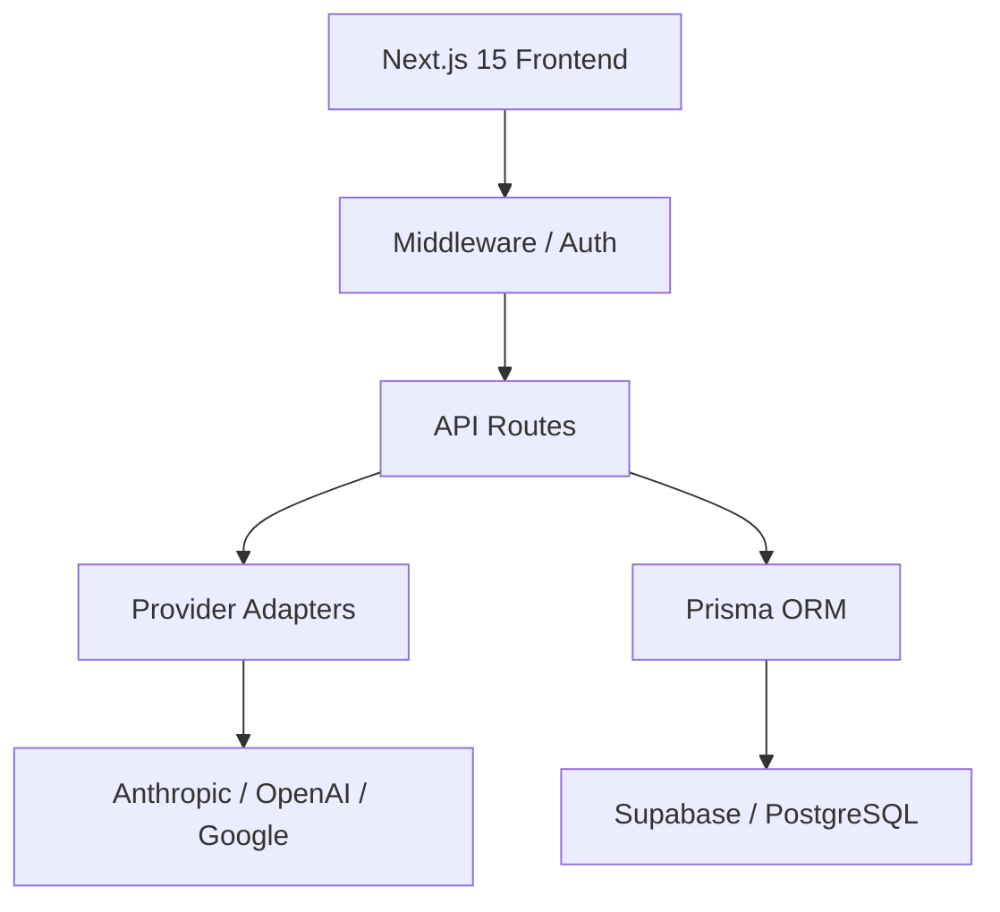

Prompt Transformer is built with a modern, high-performance tech stack designed for scalability and security.

## System Overview

## Core Components

### 1. Unified Transformer Engine
Located in `lib/transformer`, this module handles the logic of converting high-level prompt requirements into model-specific JSON payloads.

### 2. Provider Adapters
Each AI provider has a specialized adapter in `lib/providers/`. This ensures that adding a new AI model is as simple as creating a new adapter class.

### 3. Data Layer
We use **Prisma** as our ORM and **Supabase** for our PostgreSQL database. This provides:
- Type-safe database queries.
- Real-time data synchronization.
- Seamless authentication integration.

## Performance
- **Server Components**: We leverage Next.js 15 Server Components for fast initial loads.
- **Streaming**: AI responses are streamed to the client using Server-Sent Events (SSE) for a responsive UI.
