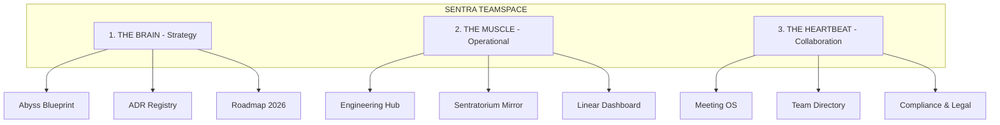

---
id: abyss-notion-workspace
type: specification
status: draft
owner: gemini-cli-jen
tags: [notion, governance, documentation]
---

# 📋 SPEC: Sentra AI Teamspace & Governance Architecture

## 🔍 1. Overview
Spesifikasi ini merancang struktur **Notion Teamspace** yang profesional, terukur, dan *AI-Ready* untuk ekosistem **The Abyss**. Tujuannya adalah menyinkronkan aktivitas teknis di monorepo dengan visi strategis pimpinan (Chief) dalam satu "Single Source of Truth".

## 🏗️ 2. Architecture & Design

Arsitektur ruang kerja dibagi menjadi 3 Pillar Utama untuk memisahkan konteks antara strategi, eksekusi teknis, dan koordinasi tim.

### Pillar Detail:
1.  **The Brain (Strategi)**: Fokus pada dokumentasi jangka panjang. Sinkron dengan `/docs/blueprint` dan `/docs/adr`.
2.  **The Muscle (Operasional)**: Jembatan antara kode dan manajemen. Sinkron dengan `/docs/sentratorium` dan tiket Linear.
3.  **The Heartbeat (Kolaborasi)**: Aktivitas harian tim, catatan rapat, dan kepatuhan (HIPAA/FHIR untuk Healthcare domain).

## 📊 3. Data Schema (Notion Databases)

| Database Name | Fields | Sync Source |
|---------------|--------|-------------|
| **ADR Registry** | ID, Title, Status, Date, Owner, Tags | `docs/adr/*.md` |
| **Session Logs** | Session ID, Agent, Phase, Result, Handoff Link | `docs/sentratorium/sessions/*/` |
| **Roadmap Q2** | Feature, Priority, Status, Target Date | Notion Internal |
| **Action Items** | Task Name, Owner, Due Date, Status | Linear Issues |

## 🛡️ 4. Security & Compliance
- **Access Control**: 
  - `Admin`: Full access (Chief).
  - `Member`: View/Edit (Engineering Team).
  - `AI Bot`: API access (untuk sinkronisasi otomatis).
- **Compliance**: Area khusus untuk dokumen HIPAA/FHIR dengan enkripsi tambahan dan audit log yang lebih ketat.

## 🧪 5. Verification Plan
- [ ] Verifikasi sinkronisasi otomatis via GitHub Actions/Composio.
- [ ] Test: Pastikan file `HANDOFF.md` baru otomatis muncul sebagai entri di database `Session Logs`.
- [ ] Audit: Pastikan keputusan penting di `docs/adr/` terindeks di Notion `ADR Registry`.

---
© 2026 Sentra Artificial Intelligence
