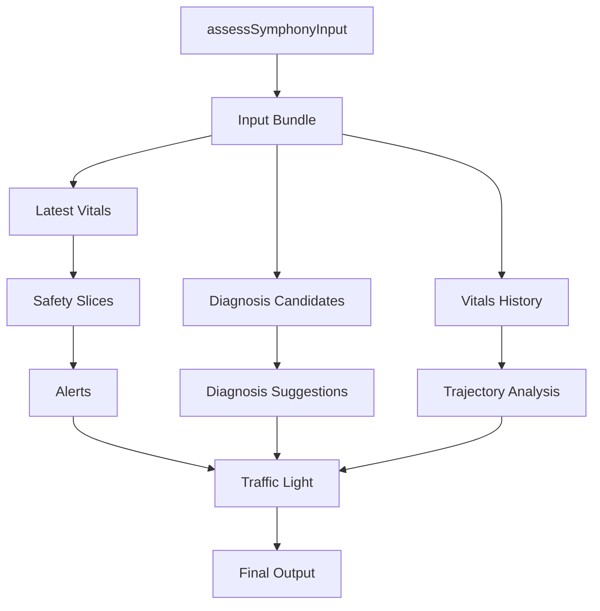

# MASTER INSTRUCTION — SENTRA AADI / SYMPHONY DIAGNOSIS ENGINE V2

**Dokumen:** Instruksi lengkap implementasi task-by-task untuk Codex / Claude Code
**Target:** Transformasi Symphony / AADI dari safety-triage engine menjadi native diagnosis reasoning engine
**Mode eksekusi:** Sequential, governance-first, safety-preserving
**Bahasa kerja:** TypeScript / pnpm / monorepo The Abyss
**Status:** Implementation Instruction Draft v1.0

---

## 0. Tujuan Dokumen

Dokumen ini adalah **instruksi operasional tunggal** untuk coding agent seperti Codex / Claude Code agar dapat mengimplementasikan **Diagnosis Engine v2** secara bertahap, aman, dan tidak merusak safety layer yang sudah ada.

Dokumen ini **bukan proposal konseptual**. Ini adalah instruksi kerja.

Agent harus membaca dokumen ini dari awal sampai akhir sebelum melakukan perubahan kode.

---

## 1. Konteks Produk

Sentra Healthcare AI menggunakan prinsip **Human-AI Collaboration**.

Diagnosis Engine tidak boleh menggantikan dokter. Engine hanya berfungsi sebagai **clinical decision-support copilot** yang membantu:

1. Deteksi risiko klinis.
2. Differential diagnosis awal.
3. Must-not-miss detection.
4. Medication safety.
5. Triage urgency.
6. Missing data prompt.
7. Explainable clinical reasoning.
8. Audit trail.

Final decision tetap berada pada dokter / klinisi berlisensi.

---

## 2. Konteks Teknis

Target sistem adalah **AADI / Symphony Diagnosis Engine v2**.

Current engine diasumsikan berada di sekitar:

```txt
packages/symphony/src/engine/assess.ts
```

Current engine sudah memiliki deterministic clinical safety layer, termasuk:

- NEWS2 scoring
- vital alerts
- instant screening gates
- PE suspect detection
- anaphylaxis detection
- composite deterioration
- trajectory analysis
- early warning patterns
- DDI check
- traffic-light escalation
- hybrid diagnosis candidate handling

Masalah utama current engine:

- diagnosis masih bergantung pada `diagnosisCandidates` eksternal
- `assessSymphonyInput()` terlalu monolithic
- `metadata.status` masih dapat berada pada `degraded`
- `confidenceBand` sering berada pada `insufficient_data`
- belum ada native differential diagnosis core
- belum ada modular diagnosis pack registry
- belum ada FHIR-ready output contract
- belum ada golden regression suite yang cukup kuat untuk refactor besar

---

## 3. Non-Negotiable Clinical Safety Rules

Agent wajib mengikuti aturan berikut.

```txt
1. AI is advisory only.
2. Human clinician remains final authority.
3. Safety always dominates diagnosis probability.
4. Critical alert must never return GREEN.
5. Insufficient data must never produce HIGH confidence.
6. Missing critical clinical data must trigger requires_review or insufficient_data.
7. No PHI/PII may be logged in plaintext.
8. No clinical threshold may be changed unless the task explicitly asks for it.
9. No external LLM call may be introduced in Phase 1.
10. V1 behavior must remain default until V2 is explicitly feature-flagged.
```

---

## 4. Governance Rules for Agent

Before coding, agent must comply with The Abyss governance flow.

### 4.1 Required Execution Protocol

For each task:

1. Read relevant `AGENTS.md` files.
2. Create / update a `HANDOFF.md` session if the repo already uses this workflow.
3. State the task ID and scope.
4. List files to modify.
5. Confirm forbidden files.
6. Implement only the requested scope.
7. Run verification commands.
8. Return changed files and proof-of-verification.
9. Do not continue to the next task automatically unless explicitly instructed.

### 4.2 Forbidden Agent Behavior

Agent must not:

- rewrite large unrelated areas
- change clinical thresholds silently
- modify public API shape without adapter
- introduce external dependencies unless requested
- introduce LLM diagnosis logic in Phase 1
- remove existing tests
- skip failing tests
- suppress TypeScript errors with `any`
- log patient-identifiable data
- change v1 default behavior
- claim tests passed unless actually run

---

## 5. Global Definition of Done

Every task is complete only when:

```txt
[ ] Scope stayed within allowed files
[ ] TypeScript compiles
[ ] Lint passes or failures are reported honestly
[ ] Tests pass or failures are reported honestly
[ ] No clinical threshold changed without instruction
[ ] No PHI/PII logging introduced
[ ] Public API compatibility preserved unless task says otherwise
[ ] Safety-sensitive behavior has tests or documented follow-up
[ ] Changed files are listed
[ ] Remaining risks are listed
```

---

## 6. Target Architecture

Final Phase 1 architecture:

```txt
packages/symphony/src/
  engine/
    assess.ts
    assess-v2.ts

    normalization/
      normalize-clinical-input.ts
      normalize-vitals.ts
      normalize-complaints.ts
      normalize-medications.ts
      normalize-history.ts
      index.ts

    safety/
      safety-engine.ts
      safety-engine.types.ts
      index.ts

    trajectory/
      trajectory-engine.ts
      vital-trend-detector.ts
      trajectory.types.ts
      index.ts

    medication-safety/
      medication-safety-engine.ts
      ddi-adapter.ts
      allergy-checker.ts
      pregnancy-caution-checker.ts
      index.ts

    differential/
      differential-engine.ts
      syndrome-classifier.ts
      candidate-generator.ts
      diagnosis-scorer.ts
      must-not-miss.ts
      diagnosis-pack-registry.ts
      index.ts

    arbiter/
      clinical-arbiter.ts
      traffic-light-arbiter.ts
      confidence-arbiter.ts
      action-protocol-builder.ts
      index.ts

    explainability/
      explanation-builder.ts
      missing-data-builder.ts
      evidence-ref-builder.ts
      clinician-summary-builder.ts
      index.ts

  clinical-packs/
    indonesia-primary-care/
      types.ts
      dengue.pack.ts
      tb-suspect.pack.ts
      preeclampsia.pack.ts
      index.ts

  types/
    diagnosis-engine.types.ts
    clinical-facts.types.ts
    safety.types.ts
    differential.types.ts
    trajectory.types.ts
    medication-safety.types.ts
    explainability.types.ts
    index.ts

  __tests__/
    golden-safety/
      anaphylaxis.golden.test.ts
      pe-suspect.golden.test.ts
      news2.golden.test.ts
      vital-alerts.golden.test.ts
      ddi.golden.test.ts
      no-unsafe-green.golden.test.ts
```

---

## 7. High-Level Runtime Flow

Target V2 runtime:

```txt
assessSymphonyInputV2(input)
  → normalizeClinicalInput(input)
  → runSafetyEngine(facts)
  → runTrajectoryEngine(facts)
  → runMedicationSafetyEngine(facts)
  → runDifferentialEngine(facts)
  → runClinicalArbiter(...)
  → build explainable result
  → return DiagnosisEngineResult-compatible output
```

V1 remains default.

```ts
export function assessSymphonyInput(input: SymphonyInput): SymphonyResult {
  if (input.metadata?.featureFlags?.diagnosisEngineV2 === true) {
    return assessSymphonyInputV2(input);
  }

  return assessSymphonyInputV1(input);
}
```

If current implementation does not have `assessSymphonyInputV1`, create a safe internal alias during integration task only.

---

# PHASE 1 — NATIVE DIAGNOSTIC CORE FOUNDATION

---

## P1.1 — Audit Current Flow

### Task ID

`P1.1.1`

### Task Name

Audit Current Symphony Assessment Flow

### Objective

Map current `assessSymphonyInput()` behavior before refactor.

### Allowed Files

```txt
docs/architecture/symphony/current-assessment-flow.md
```

Read-only:

```txt
packages/symphony/src/engine/assess.ts
packages/symphony/src/**/*.ts
packages/symphony/**/*.test.ts
```

### Forbidden

```txt
Do not modify source code.
Do not modify tests.
Do not modify package configuration.
Do not change clinical thresholds.
```

### Required Output

Create:

```txt
docs/architecture/symphony/current-assessment-flow.md
```

Document must include:

```txt
1. Executive Summary
2. Current Entry Point
3. Input Bundle Map
4. Runtime Flow Map
5. Safety Slice Inventory
6. Diagnosis Candidate Dependency
7. Trajectory Analysis Path
8. DDI / Medication Safety Path
9. Traffic-Light Escalation Path
10. Output Object Map
11. Current Degraded / Insufficient Data Behavior
12. External Dependencies
13. Regression-Sensitive Areas
14. Proposed Refactor Boundaries
15. Recommended Next Tasks
```

### Required Mermaid Flow

Include a Mermaid flowchart that reflects actual current code.



Update this flow if actual code differs.

### Acceptance Criteria

```txt
[ ] Only markdown document created
[ ] No source code changed
[ ] Current input fields documented
[ ] Current output fields documented
[ ] Safety functions identified
[ ] diagnosisCandidates dependency explained
[ ] degraded / insufficient_data behavior documented
[ ] refactor boundaries proposed
```

### Verification

```bash
git diff --stat
git diff -- docs/architecture/symphony/current-assessment-flow.md
```

---

## P1.2 — Define Type Contracts

### Task ID

`P1.2.1`

### Task Name

Define Diagnosis Engine Type Contracts

### Objective

Create strict TypeScript type contracts for V2 modules.

### Allowed Files

```txt
packages/symphony/src/types/diagnosis-engine.types.ts
packages/symphony/src/types/clinical-facts.types.ts
packages/symphony/src/types/safety.types.ts
packages/symphony/src/types/differential.types.ts
packages/symphony/src/types/trajectory.types.ts
packages/symphony/src/types/medication-safety.types.ts
packages/symphony/src/types/explainability.types.ts
packages/symphony/src/types/index.ts
```

### Forbidden

```txt
Do not modify assess.ts.
Do not implement runtime logic.
Do not modify tests unless required only for export path correction.
Do not use any unless documented.
```

### Required Types

#### diagnosis-engine.types.ts

```ts
export type DiagnosisEngineStatus =
  | 'ok'
  | 'insufficient_data'
  | 'requires_review'
  | 'degraded';

export type TrafficLight = 'GREEN' | 'YELLOW' | 'RED';

export type ConfidenceBand =
  | 'insufficient_data'
  | 'low'
  | 'moderate'
  | 'high';

export type ClinicalActionRecommendation = {
  id: string;
  label: string;
  urgency: 'routine' | 'soon' | 'urgent' | 'emergency';
  rationale: string;
  targetRole?: 'doctor' | 'nurse' | 'midwife' | 'pharmacist' | 'admin';
};

export type DiagnosisAuditMeta = {
  engineVersion: string;
  rulesetVersion: string;
  modelVersion?: string;
  timestamp: string;
  featureFlag?: string;
};

export type DiagnosisEngineResult = {
  status: DiagnosisEngineStatus;
  trafficLight: TrafficLight;
  confidenceBand: ConfidenceBand;
  mostLikely: DiagnosisSuggestion[];
  mustNotMiss: DiagnosisSuggestion[];
  missingData: MissingDataPrompt[];
  safetyAlerts: SafetyAlert[];
  medicationIssues: MedicationSafetyIssue[];
  trajectoryFindings: TrajectoryFinding[];
  nextSteps: ClinicalActionRecommendation[];
  evidenceRefs: EvidenceRef[];
  audit: DiagnosisAuditMeta;
};
```

Import referenced types from their files.

#### clinical-facts.types.ts

```ts
export type Sex = 'male' | 'female' | 'unknown';

export type PregnancyStatus =
  | 'pregnant'
  | 'not_pregnant'
  | 'unknown'
  | 'not_applicable';

export type DemographicFacts = {
  age?: number;
  sex: Sex;
  pregnancyStatus?: PregnancyStatus;
};

export type VitalFacts = {
  temperatureC?: number;
  systolicBp?: number;
  diastolicBp?: number;
  heartRate?: number;
  respiratoryRate?: number;
  spo2?: number;
  consciousness?: string;
};

export type VitalSnapshot = VitalFacts & {
  recordedAt?: string;
};

export type ComplaintFact = {
  id: string;
  text: string;
  normalized?: string;
  onset?: string;
  duration?: string;
  severity?: 'mild' | 'moderate' | 'severe' | 'unknown';
  negated?: boolean;
};

export type MedicationFact = {
  id: string;
  name: string;
  normalizedName?: string;
  dose?: string;
  route?: string;
  frequency?: string;
};

export type AllergyFact = {
  id: string;
  substance: string;
  reaction?: string;
  severity?: 'low' | 'moderate' | 'high' | 'critical' | 'unknown';
};

export type ChronicDiseaseFact = {
  id: string;
  label: string;
  normalized?: string;
};

export type HistoryFact = {
  id: string;
  label: string;
  value?: string;
};

export type DataQualitySignal = {
  id: string;
  field: string;
  severity: 'info' | 'warning' | 'critical';
  message: string;
  impact:
    | 'no_impact'
    | 'limits_confidence'
    | 'requires_review'
    | 'blocks_diagnosis';
};

export type ClinicalFacts = {
  demographics: DemographicFacts;
  vitals: VitalFacts;
  vitalsHistory: VitalSnapshot[];
  complaints: ComplaintFact[];
  history: HistoryFact[];
  allergies: AllergyFact[];
  activeMedications: MedicationFact[];
  chronicDiseases: ChronicDiseaseFact[];
  dataQuality: DataQualitySignal[];
};
```

#### safety.types.ts

```ts
export type SafetySeverity =
  | 'none'
  | 'low'
  | 'moderate'
  | 'high'
  | 'critical';

export type SafetyAlert = {
  id: string;
  label: string;
  severity: Exclude<SafetySeverity, 'none'>;
  source:
    | 'news2'
    | 'vital_alert'
    | 'screening_gate'
    | 'pe_suspect'
    | 'anaphylaxis'
    | 'trajectory'
    | 'medication'
    | 'unknown';
  message: string;
  evidence: string[];
  recommendedAction?: string;
};

export type SafetyEngineResult = {
  alerts: SafetyAlert[];
  redFlags: SafetyAlert[];
  yellowFlags: SafetyAlert[];
  hasCriticalAlert: boolean;
  highestSeverity: SafetySeverity;
};
```

#### differential.types.ts

```ts
export type DiagnosisUrgency =
  | 'routine'
  | 'soon'
  | 'urgent'
  | 'emergency';

export type DiagnosisSuggestion = {
  id: string;
  label: string;
  icd10Hint?: string;
  probabilityBand: 'low' | 'moderate' | 'high';
  urgency: DiagnosisUrgency;
  supportingEvidence: string[];
  negativeEvidence: string[];
  missingData: string[];
  mustNotMiss: boolean;
};

export type MissingDataPrompt = {
  id: string;
  field: string;
  question: string;
  reason: string;
  priority: 'low' | 'medium' | 'high' | 'critical';
};

export type DifferentialEngineResult = {
  mostLikely: DiagnosisSuggestion[];
  mustNotMiss: DiagnosisSuggestion[];
  missingData: MissingDataPrompt[];
  confidenceBand: ConfidenceBand;
};

export type Syndrome =
  | 'fever'
  | 'respiratory'
  | 'abdominal'
  | 'maternal'
  | 'metabolic'
  | 'cardiovascular'
  | 'neurologic'
  | 'unknown';
```

#### trajectory.types.ts

```ts
export type TrajectoryDirection =
  | 'improving'
  | 'stable'
  | 'worsening'
  | 'unknown';

export type TrajectoryFinding = {
  id: string;
  label: string;
  severity: 'low' | 'moderate' | 'high';
  direction: TrajectoryDirection;
  evidence: string[];
};

export type TrajectoryEngineResult = {
  findings: TrajectoryFinding[];
  overallDirection: TrajectoryDirection;
  hasWorseningPattern: boolean;
};
```

#### medication-safety.types.ts

```ts
export type MedicationSafetyIssue = {
  id: string;
  type: 'ddi' | 'allergy' | 'contraindication' | 'pregnancy_caution';
  severity: 'low' | 'moderate' | 'high' | 'critical';
  medications: string[];
  explanation: string;
  recommendedAction: string;
};
```

#### explainability.types.ts

```ts
export type EvidenceRef = {
  id: string;
  source: string;
  title?: string;
  url?: string;
  excerpt?: string;
  strength: 'weak' | 'moderate' | 'strong';
};

export type ClinicalExplanation = {
  summary: string;
  supportingEvidence: string[];
  uncertainty: string[];
  missingData: string[];
};
```

### Acceptance Criteria

```txt
[ ] All type files created
[ ] index.ts exports all types
[ ] No runtime behavior changed
[ ] No assess.ts modification
[ ] pnpm typecheck passes or errors reported
[ ] pnpm lint passes or errors reported
```

### Verification

```bash
pnpm typecheck
pnpm lint
```

---

## P1.3 — Create Clinical Normalization Layer

### Task ID

`P1.3.1`

### Task Name

Create Clinical Normalization Layer

### Objective

Convert raw Symphony input into `ClinicalFacts`.

### Allowed Files

```txt
packages/symphony/src/engine/normalization/normalize-clinical-input.ts
packages/symphony/src/engine/normalization/normalize-vitals.ts
packages/symphony/src/engine/normalization/normalize-complaints.ts
packages/symphony/src/engine/normalization/normalize-medications.ts
packages/symphony/src/engine/normalization/normalize-history.ts
packages/symphony/src/engine/normalization/index.ts
packages/symphony/src/types/clinical-facts.types.ts
```

### Forbidden

```txt
Do not modify assess.ts.
Do not implement diagnosis scoring.
Do not modify safety logic.
Do not call external models.
Do not add external dependencies.
```

### Required Functions

```ts
export function normalizeClinicalInput(input: unknown): ClinicalFacts;
export function normalizeVitals(input: unknown): VitalFacts;
export function normalizeComplaints(input: unknown): ComplaintFact[];
export function normalizeMedications(input: unknown): MedicationFact[];
export function normalizeHistory(input: unknown): HistoryFact[];
```

### Required Behavior

```txt
1. Missing vitals must not crash.
2. Missing medication list must not crash.
3. Missing complaints must not crash.
4. Missing demographic fields must produce dataQuality signals.
5. Empty vitalsHistory is allowed.
6. Ordinary missing clinical data should create DataQualitySignal, not throw.
7. Throw only when input is structurally invalid and cannot be parsed at all.
```

### Required Data Quality Signals

Implement at least:

```txt
missing_age
missing_sex
missing_vitals
missing_medication_list
missing_pregnancy_status_if_relevant
empty_vitals_history
```

### Acceptance Criteria

```txt
[ ] normalizeClinicalInput exists
[ ] All helper normalizers exist
[ ] Missing data creates DataQualitySignal
[ ] No diagnosis generated here
[ ] No safety decision generated here
[ ] TypeScript passes or errors reported
```

### Verification

```bash
pnpm typecheck
pnpm lint
```

---

## P1.4 — Create Safety Engine Wrapper

### Task ID

`P1.4.1`

### Task Name

Create Safety Engine Wrapper

### Objective

Create `runSafetyEngine()` as a modular wrapper around existing safety logic without changing behavior.

### Allowed Files

```txt
packages/symphony/src/engine/safety/safety-engine.ts
packages/symphony/src/engine/safety/safety-engine.types.ts
packages/symphony/src/engine/safety/index.ts
packages/symphony/src/types/safety.types.ts
```

Read-only:

```txt
packages/symphony/src/engine/assess.ts
packages/symphony/src/**/*.ts
```

### Forbidden

```txt
Do not modify assess.ts.
Do not change NEWS2 scoring.
Do not change vital alert thresholds.
Do not change PE suspect logic.
Do not change anaphylaxis logic.
Do not change traffic-light classification.
Do not change public output shape.
```

### Required Function

```ts
export function runSafetyEngine(facts: ClinicalFacts): SafetyEngineResult;
```

### Required Behavior

```txt
1. Reuse existing safety utilities when possible.
2. If exact mapping is uncertain, add TODO comment.
3. Aggregate alerts into SafetyEngineResult.
4. Do not make final traffic-light decision here.
5. Preserve severity semantics.
```

### Acceptance Criteria

```txt
[ ] runSafetyEngine exists
[ ] SafetyEngineResult returned
[ ] No clinical threshold changed
[ ] assess.ts untouched
[ ] TypeScript passes or errors reported
```

### Verification

```bash
pnpm typecheck
pnpm lint
```

---

## P1.5 — Create Trajectory Engine

### Task ID

`P1.5.1`

### Task Name

Create Trajectory Engine Skeleton

### Objective

Create a standalone trajectory engine for vitals trend analysis.

### Allowed Files

```txt
packages/symphony/src/engine/trajectory/trajectory-engine.ts
packages/symphony/src/engine/trajectory/vital-trend-detector.ts
packages/symphony/src/engine/trajectory/trajectory.types.ts
packages/symphony/src/engine/trajectory/index.ts
packages/symphony/src/types/trajectory.types.ts
```

### Forbidden

```txt
Do not modify assess.ts.
Do not change existing trajectory behavior.
Do not change safety thresholds.
Do not implement final traffic light logic.
```

### Required Function

```ts
export function runTrajectoryEngine(facts: ClinicalFacts): TrajectoryEngineResult;
```

### Required Initial Patterns

```txt
1. SpO2 decreasing → respiratory deterioration signal
2. RR increasing → respiratory distress signal
3. SBP decreasing → shock / deterioration signal
4. HR increasing with fever → systemic stress signal
5. Persistent fever → infection / inflammation signal
6. BP rising in pregnancy → maternal danger signal
```

### Required Behavior

```txt
1. Empty vitalsHistory returns overallDirection = unknown.
2. No diagnosis decision here.
3. No traffic-light decision here.
4. Findings must include evidence strings.
```

### Acceptance Criteria

```txt
[ ] runTrajectoryEngine exists
[ ] Empty history handled
[ ] Worsening pattern represented
[ ] No final diagnosis emitted
[ ] TypeScript passes or errors reported
```

### Verification

```bash
pnpm typecheck
pnpm lint
```

---

## P1.6 — Create Medication Safety Engine

### Task ID

`P1.6.1`

### Task Name

Create Medication Safety Engine Wrapper

### Objective

Create medication safety module that wraps existing DDI logic and prepares allergy / pregnancy caution checks.

### Allowed Files

```txt
packages/symphony/src/engine/medication-safety/medication-safety-engine.ts
packages/symphony/src/engine/medication-safety/ddi-adapter.ts
packages/symphony/src/engine/medication-safety/allergy-checker.ts
packages/symphony/src/engine/medication-safety/pregnancy-caution-checker.ts
packages/symphony/src/engine/medication-safety/index.ts
packages/symphony/src/types/medication-safety.types.ts
```

Read-only:

```txt
packages/symphony/src/**/*.ts
```

### Forbidden

```txt
Do not modify assess.ts.
Do not change existing DDI logic.
Do not add medication database.
Do not make medication recommendations beyond existing evidence.
Do not suppress critical DDI warnings.
```

### Required Function

```ts
export function runMedicationSafetyEngine(
  facts: ClinicalFacts
): MedicationSafetyIssue[];
```

### Required Behavior

```txt
1. Reuse existing DDI checker if available.
2. Missing medication list must not crash.
3. If less than two medications exist, DDI can return empty list.
4. Allergy checker can be conservative skeleton.
5. Pregnancy caution checker can be conservative skeleton.
```

### Acceptance Criteria

```txt
[ ] runMedicationSafetyEngine exists
[ ] DDI adapter exists
[ ] Allergy checker exists
[ ] Pregnancy caution checker exists
[ ] Missing medication list handled safely
[ ] TypeScript passes or errors reported
```

### Verification

```bash
pnpm typecheck
pnpm lint
```

---

## P1.7 — Create Differential Engine Skeleton

### Task ID

`P1.7.1`

### Task Name

Create Native Differential Engine Skeleton

### Objective

Create native differential engine skeleton without relying on external `diagnosisCandidates`.

### Allowed Files

```txt
packages/symphony/src/engine/differential/differential-engine.ts
packages/symphony/src/engine/differential/syndrome-classifier.ts
packages/symphony/src/engine/differential/candidate-generator.ts
packages/symphony/src/engine/differential/diagnosis-scorer.ts
packages/symphony/src/engine/differential/must-not-miss.ts
packages/symphony/src/engine/differential/diagnosis-pack-registry.ts
packages/symphony/src/engine/differential/index.ts
packages/symphony/src/types/differential.types.ts
```

### Forbidden

```txt
Do not modify assess.ts.
Do not remove support for external diagnosisCandidates.
Do not implement LLM logic.
Do not emit high-confidence diagnosis by default.
Do not change safety behavior.
```

### Required Functions

```ts
export function runDifferentialEngine(
  facts: ClinicalFacts
): DifferentialEngineResult;

export function classifySyndromes(facts: ClinicalFacts): Syndrome[];

export function generateCandidates(
  facts: ClinicalFacts,
  syndromes: Syndrome[]
): DiagnosisSuggestion[];
```

### Required Behavior

```txt
1. Empty input must not crash.
2. Default confidence must be insufficient_data or low.
3. No high confidence emitted without explicit evidence.
4. Engine must return empty but valid result if no pack matches.
5. Must-not-miss support must exist even if initially conservative.
```

### Acceptance Criteria

```txt
[ ] runDifferentialEngine exists
[ ] syndrome classifier exists
[ ] candidate generator exists
[ ] diagnosis scorer placeholder exists
[ ] must-not-miss placeholder exists
[ ] no external diagnosisCandidates required
[ ] TypeScript passes or errors reported
```

### Verification

```bash
pnpm typecheck
pnpm lint
```

---

## P1.8 — Create Indonesia Primary Care Diagnosis Packs

### Task ID

`P1.8.1`

### Task Name

Create Indonesia Primary Care Diagnosis Pack Registry

### Objective

Create first modular Indonesia-focused diagnosis packs.

### Allowed Files

```txt
packages/symphony/src/clinical-packs/indonesia-primary-care/types.ts
packages/symphony/src/clinical-packs/indonesia-primary-care/dengue.pack.ts
packages/symphony/src/clinical-packs/indonesia-primary-care/tb-suspect.pack.ts
packages/symphony/src/clinical-packs/indonesia-primary-care/preeclampsia.pack.ts
packages/symphony/src/clinical-packs/indonesia-primary-care/index.ts
packages/symphony/src/engine/differential/diagnosis-pack-registry.ts
```

### Forbidden

```txt
Do not modify assess.ts.
Do not create final diagnosis claims.
Do not hardcode high confidence.
Do not change safety thresholds.
Do not add external libraries.
```

### Required Interface

```ts
export type DiagnosisPack = {
  id: string;
  label: string;
  appliesTo: (facts: ClinicalFacts) => boolean;
  generateCandidates: (facts: ClinicalFacts) => DiagnosisSuggestion[];
  mustNotMiss?: (facts: ClinicalFacts) => DiagnosisSuggestion[];
};
```

### Required Packs

#### 1. Dengue Suspect

Must consider:

```txt
fever
myalgia / headache / retro-orbital pain if present
bleeding sign if present
abdominal pain / persistent vomiting as warning signs if present
missing platelet count
missing hematocrit
missing hydration status
```

Must not:

```txt
emit high confidence by default
claim confirmed dengue without lab
```

#### 2. TB Suspect

Must consider:

```txt
chronic cough
weight loss
night sweats
fever duration
hemoptysis if present
TB contact if present
missing chest X-ray
missing sputum / molecular test
```

Must not:

```txt
claim confirmed TB without confirmatory test
```

#### 3. Preeclampsia

Must consider:

```txt
pregnancy status
reproductive age female with unknown pregnancy status
elevated BP
headache
visual symptoms
epigastric pain
edema if present
missing urine protein
missing gestational age
```

Must not:

```txt
run as confirmed diagnosis without pregnancy context
emit GREEN if severe maternal danger signs exist
```

### Acceptance Criteria

```txt
[ ] DiagnosisPack interface exists
[ ] Three packs created
[ ] Registry exports all packs
[ ] Packs handle missing data safely
[ ] No high confidence default
[ ] TypeScript passes or errors reported
```

### Verification

```bash
pnpm typecheck
pnpm lint
```

---

## P1.9 — Create Clinical Arbiter

### Task ID

`P1.9.1`

### Task Name

Create Clinical Arbiter

### Objective

Create final arbitration layer that merges safety, trajectory, medication safety, and differential outputs.

### Allowed Files

```txt
packages/symphony/src/engine/arbiter/clinical-arbiter.ts
packages/symphony/src/engine/arbiter/traffic-light-arbiter.ts
packages/symphony/src/engine/arbiter/confidence-arbiter.ts
packages/symphony/src/engine/arbiter/action-protocol-builder.ts
packages/symphony/src/engine/arbiter/index.ts
packages/symphony/src/types/diagnosis-engine.types.ts
```

### Forbidden

```txt
Do not modify assess.ts.
Do not change existing v1 traffic-light classifier.
Do not remove v1 behavior.
Do not emit GREEN when critical safety alerts exist.
Do not emit high confidence with insufficient data.
```

### Required Function

```ts
export function runClinicalArbiter(input: {
  facts: ClinicalFacts;
  safety: SafetyEngineResult;
  trajectory: TrajectoryEngineResult;
  medicationIssues: MedicationSafetyIssue[];
  differential: DifferentialEngineResult;
}): DiagnosisEngineResult;
```

### Arbitration Rules

```txt
1. If safety.hasCriticalAlert = true → trafficLight = RED.
2. If any critical medication issue exists → trafficLight = RED.
3. If mustNotMiss exists → trafficLight at least YELLOW.
4. If critical missing data exists → status = requires_review or insufficient_data.
5. If dataQuality contains blocks_diagnosis → confidenceBand = insufficient_data.
6. If no diagnosis candidate exists → status = insufficient_data or requires_review.
7. HIGH confidence is forbidden if missingData contains high/critical priority item.
8. GREEN requires no critical alert, no must-not-miss, no critical medication issue, and sufficient data.
```

### Acceptance Criteria

```txt
[ ] runClinicalArbiter exists
[ ] Critical safety alert produces RED
[ ] Must-not-miss produces at least YELLOW
[ ] Missing critical data prevents HIGH confidence
[ ] Empty differential with missing data returns requires_review or insufficient_data
[ ] TypeScript passes or errors reported
```

### Verification

```bash
pnpm typecheck
pnpm lint
```

---

## P1.10 — Create Explainability Layer

### Task ID

`P1.10.1`

### Task Name

Create Explainability Builders

### Objective

Create lightweight explainability helpers for clinician-facing output.

### Allowed Files

```txt
packages/symphony/src/engine/explainability/explanation-builder.ts
packages/symphony/src/engine/explainability/missing-data-builder.ts
packages/symphony/src/engine/explainability/evidence-ref-builder.ts
packages/symphony/src/engine/explainability/clinician-summary-builder.ts
packages/symphony/src/engine/explainability/index.ts
packages/symphony/src/types/explainability.types.ts
```

### Forbidden

```txt
Do not call external RAG.
Do not call LLMs.
Do not cite fabricated sources.
Do not modify assess.ts.
```

### Required Functions

```ts
export function buildClinicalExplanation(result: DiagnosisEngineResult): ClinicalExplanation;

export function buildClinicianSummary(result: DiagnosisEngineResult): string;
```

### Required Behavior

```txt
1. Explain why traffic light was assigned.
2. Explain top diagnosis suggestions.
3. Mention must-not-miss items.
4. Mention missing critical data.
5. Mention medication safety issues.
6. Keep explanation concise and clinician-oriented.
```

### Acceptance Criteria

```txt
[ ] Explanation builder exists
[ ] Clinician summary builder exists
[ ] No external dependency
[ ] No fabricated evidence references
[ ] TypeScript passes or errors reported
```

### Verification

```bash
pnpm typecheck
pnpm lint
```

---

## P1.11 — Wire V2 Behind Feature Flag

### Task ID

`P1.11.1`

### Task Name

Wire Diagnosis Engine V2 Behind Feature Flag

### Objective

Integrate V2 modules without breaking V1 default behavior.

### Allowed Files

```txt
packages/symphony/src/engine/assess.ts
packages/symphony/src/engine/assess-v2.ts
packages/symphony/src/engine/index.ts
```

### Forbidden

```txt
Do not make V2 default.
Do not remove V1 behavior.
Do not remove degraded fallback from V1.
Do not change clinical thresholds.
Do not change public input/output shape unless adapter is included.
```

### Required Behavior

```txt
1. V1 remains default.
2. V2 runs only when feature flag is true.
3. V2 failure must not crash the app.
4. V2 failure returns safe degraded / requires_review fallback.
5. V2 pipeline uses:
   - normalizeClinicalInput
   - runSafetyEngine
   - runTrajectoryEngine
   - runMedicationSafetyEngine
   - runDifferentialEngine
   - runClinicalArbiter
```

### Suggested Implementation

```ts
export function assessSymphonyInput(input: SymphonyInput): SymphonyResult {
  if (input.metadata?.featureFlags?.diagnosisEngineV2 === true) {
    return assessSymphonyInputV2(input);
  }

  return assessSymphonyInputV1(input);
}
```

If the current code has only `assessSymphonyInput`, rename internal implementation carefully:

```txt
Old assessSymphonyInput body → assessSymphonyInputV1
New public assessSymphonyInput → feature flag router
```

### Safe Fallback Rule

If V2 throws:

```txt
status = degraded
trafficLight = YELLOW
confidenceBand = insufficient_data
nextSteps includes "Clinician review required"
```

Never fail open to GREEN.

### Acceptance Criteria

```txt
[ ] V1 remains default
[ ] V2 only runs with feature flag
[ ] V2 pipeline compiles
[ ] V2 failure returns safe fallback
[ ] Existing tests pass or failures reported
[ ] TypeScript passes or errors reported
```

### Verification

```bash
pnpm typecheck
pnpm lint
pnpm test
```

---

## P1.12 — Golden Safety Regression Suite

### Task ID

`P1.12.1`

### Task Name

Create Golden Safety Regression Suite

### Objective

Create regression tests that prevent unsafe clinical refactor.

### Allowed Files

```txt
packages/symphony/src/__tests__/golden-safety/anaphylaxis.golden.test.ts
packages/symphony/src/__tests__/golden-safety/pe-suspect.golden.test.ts
packages/symphony/src/__tests__/golden-safety/news2.golden.test.ts
packages/symphony/src/__tests__/golden-safety/vital-alerts.golden.test.ts
packages/symphony/src/__tests__/golden-safety/ddi.golden.test.ts
packages/symphony/src/__tests__/golden-safety/no-unsafe-green.golden.test.ts
```

### Forbidden

```txt
Do not modify production logic.
Do not weaken existing assertions.
Do not skip tests.
Do not snapshot timestamps.
Do not create tests that rely on current date/time.
```

### Required Golden Rules

```txt
1. Anaphylaxis suspect cannot return GREEN.
2. PE high concern cannot return GREEN.
3. Critical NEWS2 cannot return GREEN.
4. Severe abnormal vital cannot return GREEN.
5. Critical DDI cannot be silently ignored.
6. Missing critical data cannot produce HIGH confidence.
7. V2 failure fallback cannot return GREEN.
```

### Acceptance Criteria

```txt
[ ] Golden safety tests exist
[ ] Tests are deterministic
[ ] Critical safety scenarios cannot return GREEN
[ ] Missing critical data prevents HIGH confidence
[ ] Test suite runs or failures reported
```

### Verification

```bash
pnpm test --filter=@the-abyss/symphony
pnpm typecheck
pnpm lint
```

---

# PHASE 2 — FHIR, EVIDENCE, SHADOW MODE

Do not start Phase 2 until Phase 1 is complete.

---

## P2.1 — FHIR Input / Output Adapter

### Task ID

`P2.1.1`

### Objective

Map FHIR-like resources into Symphony input and Symphony output into FHIR-like diagnostic resources.

### Target Files

```txt
packages/fhir-engine/src/symphony/fhir-to-symphony-input.ts
packages/fhir-engine/src/symphony/symphony-to-fhir-output.ts
packages/fhir-engine/src/symphony/condition-mapper.ts
packages/fhir-engine/src/symphony/observation-mapper.ts
packages/fhir-engine/src/symphony/risk-assessment-mapper.ts
packages/fhir-engine/src/symphony/diagnostic-report-mapper.ts
packages/fhir-engine/src/symphony/index.ts
```

### Required Mapping

```txt
FHIR Patient → patientContext / demographics
FHIR Observation → vitals / labs
FHIR MedicationStatement → activeMedications
FHIR AllergyIntolerance → allergies
Symphony diagnosis → Condition
Symphony safety risk → RiskAssessment
Symphony explanation → DiagnosticReport
Medication issue → DetectedIssue-like structure
```

### Acceptance Criteria

```txt
[ ] FHIR-like bundle can become Symphony input
[ ] Symphony output can become FHIR-like resources
[ ] Invalid resources return structured error
[ ] No PHI logged
```

---

## P2.2 — Terminology Mapping

### Task ID

`P2.2.1`

### Objective

Add ICD-10 hints and terminology resolver.

### Target Files

```txt
packages/clinical-references/src/terminology/icd10-map.ts
packages/clinical-references/src/terminology/loinc-map.ts
packages/clinical-references/src/terminology/snomed-map.ts
packages/clinical-references/src/terminology/terminology-resolver.ts
packages/clinical-references/src/terminology/index.ts
```

### Acceptance Criteria

```txt
[ ] ICD-10 resolver exists
[ ] Diagnosis pack can include icd10Hint
[ ] Unmapped diagnosis returns review-required terminology status
[ ] No fake codes created
```

---

## P2.3 — Evidence Layer Stub

### Task ID

`P2.3.1`

### Objective

Create evidence layer interface without external RAG implementation yet.

### Target Files

```txt
packages/symphony/src/engine/evidence/evidence-rag-client.ts
packages/symphony/src/engine/evidence/evidence-query-builder.ts
packages/symphony/src/engine/evidence/evidence-ranker.ts
packages/symphony/src/engine/evidence/evidence-ref-builder.ts
packages/symphony/src/engine/evidence/index.ts
```

### Hard Rules

```txt
1. Evidence supports diagnosis; it does not create final diagnosis.
2. No evidence means no citation.
3. Do not fabricate guideline references.
4. RAG must not override safety.
```

---

## P2.4 — Shadow Mode Comparator

### Task ID

`P2.4.1`

### Objective

Run V1 and V2 in parallel and compare outputs.

### Target Files

```txt
packages/symphony/src/shadow-mode/shadow-runner.ts
packages/symphony/src/shadow-mode/output-comparator.ts
packages/symphony/src/shadow-mode/disagreement-classifier.ts
packages/symphony/src/shadow-mode/shadow-metrics.ts
packages/symphony/src/shadow-mode/index.ts
```

### Disagreement Levels

```txt
LOW:
- Same traffic light, different low-risk diagnosis order

MEDIUM:
- Same traffic light, different must-not-miss list

HIGH:
- Different GREEN vs YELLOW

SAFETY_CRITICAL:
- Old RED vs new GREEN
- New misses old critical alert
- Critical DDI disappears
```

---

## P2.5 — Evaluation Harness

### Task ID

`P2.5.1`

### Objective

Create golden case evaluator.

### Target Files

```txt
packages/diagnosis-evals/golden-cases/fever.cases.json
packages/diagnosis-evals/golden-cases/respiratory.cases.json
packages/diagnosis-evals/golden-cases/maternal.cases.json
packages/diagnosis-evals/golden-cases/metabolic.cases.json
packages/diagnosis-evals/evaluator.ts
packages/diagnosis-evals/metrics.ts
packages/diagnosis-evals/README.md
```

### Required Metrics

```txt
red_flag_sensitivity
unsafe_green_rate
top_3_agreement
must_not_miss_recall
missing_data_quality
```

---

# PHASE 3 — PILOT, LOCALIZATION, OFFLINE, SCALE

Do not start Phase 3 until Phase 2 is stable.

---

## P3.1 — Pilot Deployment Mode

### Target Files

```txt
apps/healthcare/aadi-service/src/config/deployment-mode.ts
apps/healthcare/aadi-service/src/config/pilot-site.config.ts
apps/healthcare/aadi-service/src/config/feature-flags.ts
```

### Required Features

```txt
pilot mode
site-level feature flags
diagnosisEngineV2 kill switch
readonly shadow mode
safe fallback
```

---

## P3.2 — Offline / Edge Safety Mode

### Target Files

```txt
packages/symphony-edge/edge-safety-engine.ts
packages/symphony-edge/offline-cache.ts
packages/symphony-edge/sync-queue.ts
packages/symphony-edge/edge.types.ts
```

### Offline Rule

```txt
If offline:
- allow safety triage
- allow missing-data prompts
- allow emergency escalation
- do not claim high-confidence diagnosis
- mark output as requires_review
```

---

## P3.3 — Localization Layer

### Target Files

```txt
packages/clinical-nlp/src/localization/indonesia-symptom-dictionary.ts
packages/clinical-nlp/src/localization/regional-terms.ts
packages/clinical-nlp/src/localization/synonym-resolver.ts
packages/clinical-nlp/src/localization/localization.types.ts
```

### Initial Symptom Dictionary Examples

```ts
{
  canonical: 'dyspnea',
  terms: ['sesak', 'napas berat', 'ngos-ngosan', 'susah napas'],
  severityHints: ['tidak bisa bicara', 'bibir biru', 'napas cepat']
}

{
  canonical: 'fever',
  terms: ['demam', 'panas', 'meriang', 'panas dingin'],
  severityHints: ['kejang', 'menggigil hebat', 'penurunan kesadaran']
}
```

---

## P3.4 — Observability

### Target Files

```txt
packages/observability/src/diagnosis/diagnosis-metrics.ts
packages/observability/src/diagnosis/diagnosis-audit-log.ts
packages/observability/src/diagnosis/safety-event-log.ts
packages/observability/src/diagnosis/model-version-log.ts
```

### Required Events

```txt
diagnosis_inference_started
diagnosis_inference_completed
safety_alert_emitted
must_not_miss_emitted
clinician_override_recorded
shadow_disagreement_detected
engine_failure_fallback_used
```

---

## P3.5 — Clinical Governance Workflow

### Target Files

```txt
docs/governance/diagnosis-engine/clinical-change-policy.md
docs/governance/diagnosis-engine/diagnosis-pack-review-template.md
docs/governance/diagnosis-engine/safety-incident-review-template.md
```

### Required Policy

```txt
Every diagnosis pack change requires:
- HANDOFF.md
- GO approval
- clinical rationale
- regression test
- rollback plan
- safety review
```

---

# Recommended Execution Order

Execute exactly in this order:

```txt
1. P1.1.1 Audit Current Flow
2. P1.2.1 Define Type Contracts
3. P1.3.1 Clinical Normalization Layer
4. P1.4.1 Safety Engine Wrapper
5. P1.5.1 Trajectory Engine
6. P1.6.1 Medication Safety Engine
7. P1.7.1 Differential Engine Skeleton
8. P1.8.1 Indonesia Diagnosis Packs
9. P1.9.1 Clinical Arbiter
10. P1.10.1 Explainability Layer
11. P1.11.1 Wire V2 Behind Feature Flag
12. P1.12.1 Golden Safety Regression Suite
13. P2.1.1 FHIR Adapter
14. P2.2.1 Terminology Mapping
15. P2.3.1 Evidence Layer Stub
16. P2.4.1 Shadow Mode Comparator
17. P2.5.1 Evaluation Harness
18. P3.1 Pilot Deployment Mode
19. P3.2 Offline / Edge Safety Mode
20. P3.3 Localization Layer
21. P3.4 Observability
22. P3.5 Clinical Governance Workflow
```

---

# Final Agent Instruction

When executing this master instruction:

```txt
1. Do not execute all tasks at once.
2. Start with P1.1.1 only.
3. Complete each task fully before the next.
4. Return proof-of-verification after every task.
5. Stop after each task and wait for GO.
6. Never bypass safety rules.
7. Never make V2 default until explicitly instructed.
8. Never emit unsafe GREEN.
9. Never fabricate medical evidence.
10. Never claim clinical validation without test evidence.
```

---

# Final Expected End State

At the end of this implementation program:

```txt
[ ] Symphony V1 remains intact and default
[ ] Symphony V2 exists behind feature flag
[ ] Clinical input is normalized into ClinicalFacts
[ ] Safety engine is modular
[ ] Trajectory engine is modular
[ ] Medication safety engine is modular
[ ] Differential engine can run without external diagnosisCandidates
[ ] Indonesia primary care packs exist
[ ] Clinical arbiter enforces safety dominance
[ ] Explainability output exists
[ ] Golden safety tests prevent unsafe GREEN
[ ] FHIR adapter exists
[ ] Shadow mode can compare V1 vs V2
[ ] Evaluation harness exists
[ ] Pilot/offline/localization path is defined
[ ] Clinical governance documents exist
```

---

**End of Master Instruction.**
