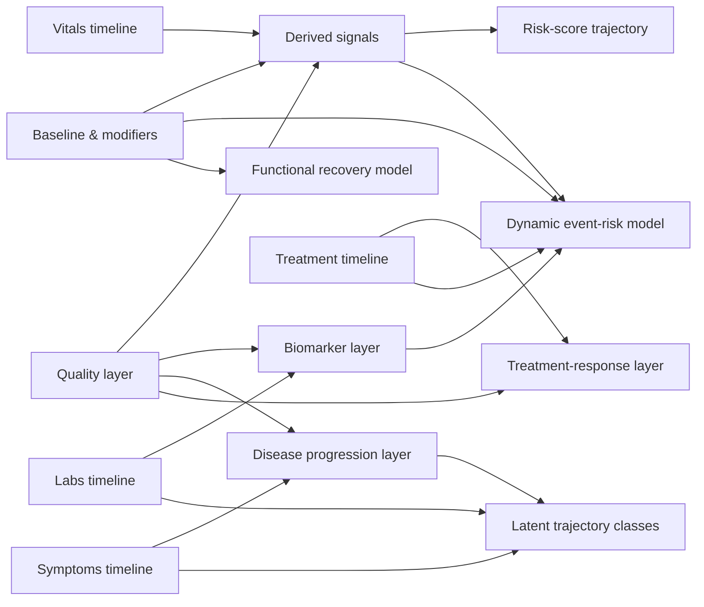
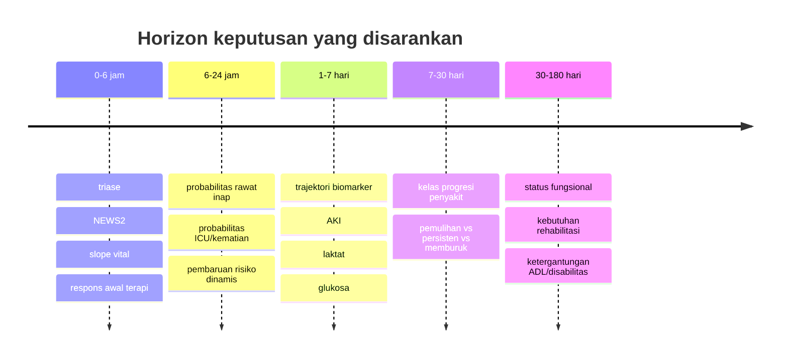
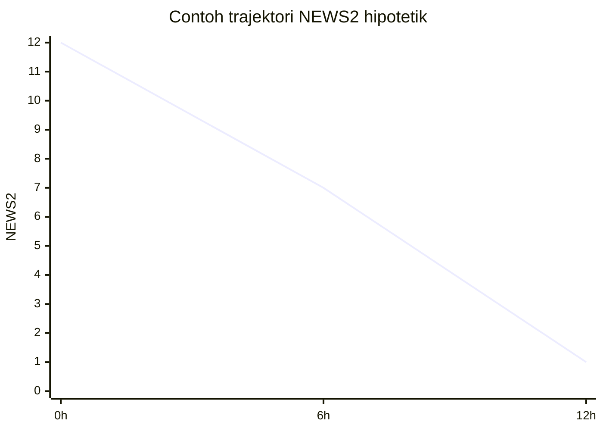
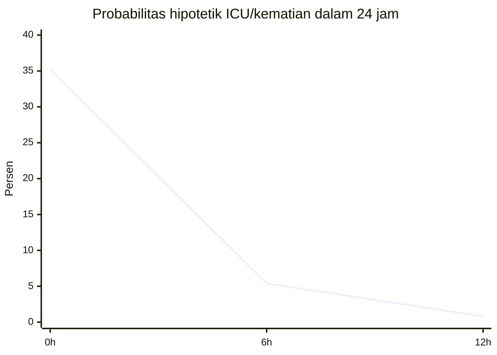

# Pemodelan Trajektori Klinis Untuk Input Yang Belum Terspesifikasi

## Ringkasan Eksekutif

Lampiran yang tersedia ternyata bukan dataset pasien, melainkan rancangan skema input dan prioritas fitur untuk engine *clinical trajectory*: baseline, konteks encounter, time-series vital, laboratorium serial, evolusi gejala, timeline terapi, sinyal turunan, penilaian respons, dan lapisan kualitas data. Artinya, yang bisa dibakukan sekarang adalah **arsitektur variabel, kelas trajektori, formula resmi yang stabil, serta model matematis yang harus diestimasi ulang pada data lokal**; sedangkan koefisien risiko numerik final tidak boleh dianggap universal tanpa pelatihan dan validasi lokal. fileciteturn0file0

Untuk praktik yang selaras dengan standar 2026, pendekatan terbaik bukan satu model tunggal, melainkan **arsitektur bertingkat**: skor perburukan fisiologis resmi untuk keputusan cepat, model probabilitas kejadian jangka pendek yang *time-updated*, model respons terapi yang sadar waktu intervensi, model biomarker/organ dysfunction yang memakai definisi resmi, model kelas trajektori penyakit untuk heterogenitas, dan model status fungsional untuk fase pasca-akut. Pada level tata kelola, studi prediksi sekarang sebaiknya dilaporkan menurut TRIPOD+AI, yang menggantikan TRIPOD 2015, dan dinilai dengan PROBAST/PROBAST+AI untuk bias, kalibrasi, diskriminasi, dan relevansi implementasi. citeturn19view0turn2search1turn20view0turn9search1

Formula resmi yang paling stabil saat ini berasal dari entity["organization","Royal College of Physicians","london uk"] untuk NEWS2, entity["organization","Kidney Disease: Improving Global Outcomes","kdigo guideline group"] dan entity["organization","National Institute of Diabetes and Digestive and Kidney Diseases","nih institute us"] untuk definisi dan transformasi fungsi ginjal, entity["organization","World Health Organization","un health agency"] untuk WHODAS 2.0, serta entity["organization","American Diabetes Association","us diabetes society"] dan entity["organization","Society of Critical Care Medicine","critical care society"] untuk target glukosa dan terapi akut terkait sepsis. Sementara itu, telaah metodologis terbaru tetap menempatkan *joint models*, *multi-state models*, *latent class mixed models*/*group-based trajectory models*, dan *segmented mixed models* sebagai keluarga model paling reproducible untuk trajektori longitudinal klinis. citeturn21view0turn21view1turn17view0turn22view2turn16view1turn17view2turn16view3turn5search0turn5search1turn5search14turn3search3

Jika harus memilih satu *default stack* untuk lampiran ini tanpa konteks penyakit spesifik, urutan yang paling kuat adalah: **NEWS2 + slope vital** untuk 0–24 jam, **logistic/joint/multi-state event model** untuk rawat inap/ICU/kematian, **segmented response model** untuk evaluasi intervensi, **lapisan biomarker resmi** untuk kreatinin-eGFR-AKI-laktat-glukosa, lalu **LCMM/GBTM dan model fungsi** untuk horizon di atas 7 hari. Ini adalah kombinasi yang paling sejalan dengan struktur lampiran dan juga dengan praktik pelaporan/validasi 2026. fileciteturn0file0 citeturn19view0turn20view0turn13search4turn15search0turn15search6turn8search17

| Jenis trajektori | Model default yang disarankan | Horizon utama | Keluaran utama |
|---|---|---:|---|
| Perburukan fisiologis akut | NEWS2 berulang + *mixed-effects slope* | 0–24 jam | memburuk/stabil/membaik, kebutuhan eskalasi |
| Probabilitas rawat inap/ICU/kematian | regresi logistik dinamis, Cox/*joint model*, *multi-state* | 6–72 jam | probabilitas kejadian spesifik |
| Respons terapi | *segmented mixed model* / *interrupted time series* | menit–48 jam | responsif vs non-responsif |
| Biomarker/organ dysfunction | *mixed model* + formula resmi (eGFR, KDIGO, lactate clearance) | 6 jam–7 hari | pemulihan, persisten, memburuk |
| Progresi penyakit | LCMM / GBTM / *joint latent class* | 7–180 hari | kelas trajektori laten |
| Status fungsional | *mixed model* / *ordinal mixed model* pada WHODAS/Barthel | 30–180 hari | pemulihan fungsi dan kebutuhan dukungan |

Tabel ringkas ini merangkum pilihan model yang paling defensible secara metodologis dan klinis untuk kondisi input yang masih umum. citeturn5search0turn5search1turn3search3turn5search14turn16view1turn19view0turn20view0

## Input, Asumsi, Dan Struktur Data

Karena lampiran tidak berisi nilai pasien aktual, populasi target, penyakit, horizon, atau granularitas keluaran, laporan ini memperlakukan semua hal tersebut sebagai **belum ditentukan**. Namun, karena lampiran memuat NEWS2, setting home/clinic/puskesmas/ED/ward/ICU, workflow, dan time-series akut, asumsi dasar yang paling masuk akal adalah **penggunaan awal pada pasien dewasa di konteks akut/observasional**, dengan opsi ekspansi ke penyakit kronis dan pasca-akut bila follow-up tersedia. Ini adalah inferensi desain, bukan klaim bahwa model yang sama otomatis valid pada anak, neonatus, atau populasi obstetri. fileciteturn0file0 citeturn16view2turn21view0turn21view1turn21view2turn21view3

| Item yang belum ditentukan | Asumsi default dalam laporan ini | Opsi yang tetap dibuka |
|---|---|---|
| Populasi pasien | Dewasa, konteks akut/observasi | pediatrik, neonatus, kehamilan, penyakit kronis |
| Kondisi/penyakit | *Disease-agnostic* dengan lapisan sepsis/respirasi/metabolik/renal | penyakit tunggal spesifik |
| Horizon | 0–24 jam, 24–72 jam, 7–30 hari, 30–180 hari | horizon lokal sesuai kebutuhan |
| Granularitas output | per observasi, jendela 4–6 jam, harian, lintasan episode | mingguan/bulanan |
| Koefisien model | ilustratif di laporan ini | harus diestimasi ulang secara lokal |
| Definisi outcome | rawat inap, ICU, kematian, status fungsional, respons terapi | outcome komposit spesifik organisasi |

Tabel asumsi ini menjaga reproducibility: formula bisa tetap, tetapi *weights* dan baseline hazard harus di-*fit* ulang sesuai populasi dan outcome lokal. citeturn19view0turn20view0turn9search13

Lampiran sendiri sudah menyarankan pemisahan yang sangat sehat antara **raw data**, **derived signals**, **response assessment**, dan **quality flags**. Secara desain, ini bagus karena auditabilitas tetap bersih: model tidak boleh menyamakan “data tidak ada” dengan “pasien aman,” dan model tingkat atas sebaiknya selalu menerima *raw timeline* sekaligus node kualitas observasi. Prinsip ini sejalan dengan best practice 2026 yang menuntut transparansi data source, definisi outcome, waktu pengukuran, dan penanganan missingness. fileciteturn0file0 citeturn19view0turn20view0turn13search4



Diagram ini merepresentasikan hubungan model yang paling cocok dengan struktur lampiran: *vitals* dan sinyal turunannya memberi keputusan cepat, laboratorium masuk ke lapisan organ dysfunction, gejala membentuk heterogenitas perjalanan penyakit, terapi diperlakukan sebagai intervensi berstempel waktu, dan kualitas data memengaruhi semua lapisan di atasnya. fileciteturn0file0 citeturn5search0turn5search1turn5search14turn19view0



Urutan horizon ini tidak baku universal, tetapi merupakan kompromi yang paling operasional ketika input yang tersedia mencakup time-series akut sekaligus follow-up serial. fileciteturn0file0 citeturn5search0turn5search1turn3search3turn16view1

## Pemetaan Variabel Ke Model

Tabel berikut memetakan semua variabel dari lampiran ke keluarga model yang relevan. Untuk menjaga keterbacaan, variabel dengan fungsi matematis identik digabung dalam satu baris, tetapi seluruh nama dari lampiran tetap dicantumkan.

| Variabel dari lampiran | Nama kanonik yang dianjurkan | Model yang memakai | Peran matematis |
|---|---|---|---|
| timestamp observasi; encounter start time; onset time; occurredAt; observation period length; waiting time; interval antar pengukuran | `t_obs`, `t0_encounter`, `t_onset`, `delta_t` | semua model longitudinal | origin waktu, lag, *windowing*, censoring |
| systolic BP; diastolic BP; MAP; pulse pressure; capillary refill | `sbp`, `dbp`, `map`, `pp`, `crt` | NEWS2, hemodynamic trajectory, response model, event-risk, sepsis perfusion | perfusi, tekanan, *shock* |
| heart rate; usualHeartRate | `hr`, `hr_baseline` | NEWS2, shock index, response model, event-risk | komponen skor, deviasi dari baseline |
| respiratory rate; usualRespiratoryRate | `rr`, `rr_baseline` | NEWS2, respiratory trajectory, event-risk | komponen skor, distress proxy |
| temperature; fever burden; feverFlag | `temp_c`, `fever_auc`, `fever_flag` | NEWS2, infection trajectory, response model | inflamasi dan perubahan setelah terapi |
| SpO2; usualSpO2; oxygen supplementation; FiO2; SpO2 drop rate; respiratory distress proxy | `spo2`, `spo2_baseline`, `oxygen_lpm`, `fio2`, `spo2_slope`, `resp_distress` | NEWS2, respiratory trajectory, response model, event-risk | oksigenasi, kebutuhan support, desaturasi |
| consciousness/AVPU/GCS; consciousness deterioration flag | `cns_level`, `gcs`, `cns_drop` | NEWS2, neurologic trajectory, event-risk | status neurologis dan perburukan |
| pain score | `pain_score` | symptom trajectory, treatment-response, functional models | gejala serial dan outcome pasien |
| NEWS2 total; NEWS2 subscores | `news2_total`, `news2_rr`, `news2_spo2`, dst. | risk-score trajectory, event-risk | *time-updated summary predictor* |
| shock index; hemodynamic instability flag | `shock_index`, `hemo_flag` | hemodynamic trajectory, event-risk, response model | ringkasan hemodinamik |
| trend slope per vital; volatility/variability per vital | `slope_x`, `var_x` | mixed model, event-risk, latent classes | kecepatan perubahan dan instabilitas |
| glucose serial; glucoseCategory | `glucose`, `glucose_cat` | biomarker trajectory, response model, disease progression | metabolik dan target terapi |
| Hb/Ht; WBC; neutrophil; platelet | `hb`, `hct`, `wbc`, `neut`, `plt` | biomarker trajectory, infection/event-risk | hematologi dan inflamasi |
| creatinine; eGFR; urine output bila tersedia di v2 | `scr`, `egfr`, `uo` | AKI trajectory, biomarker layer, event-risk | fungsi ginjal, staging AKI |
| sodium; potassium; CRP; procalcitonin; lactate; AST; ALT; bilirubin; urine ketone; blood gas; urinalysis | `na`, `k`, `crp`, `pct`, `lactate`, `ast`, `alt`, `bili`, `ketone`, `abg`, `ua` | biomarker trajectory, disease progression, event-risk | organ dysfunction dan etiologi |
| chief complaint; duration; progression worsening/improving/fluktuatif; symptom intensity; new symptom cluster; red flags; persistence after treatment | `cc`, `symptom_duration`, `symptom_trend`, `symptom_intensity`, `cluster_new`, `red_flag`, `persistent_after_tx` | latent trajectory classes, event-risk, response model | progresi subjektif penyakit |
| response terhadap intervensi awal; apakah HR turun/RR turun/BP naik/fever turun/SpO2 naik | `delta_after_tx` per komponen | treatment-response, causal response modeling | perubahan level dan slope pascaintervensi |
| obat/intervensi diberikan kapan; dosis; route; perubahan rate infus; response window; rescue meds needed; repeated intervention needed; adverse effect/intolerance | `tx_time`, `dose`, `route`, `infusion_rate`, `response_window`, `rescue_flag`, `repeat_tx_flag`, `ae_flag` | segmented mixed model, ITS, event-risk | indikator intervensi dan pascaintervensi |
| setting home/clinic/puskesmas/ED/ward/ICU; referral in/out; triage acuity; transfer/escalation event; discharge vs admit decision; clinician touchpoints | `setting`, `ref_in`, `ref_out`, `triage`, `transfer`, `disposition`, `touchpoints` | multistate, event-risk, workflow calibration | state, transisi, *care pathway* |
| age; sex at birth; pregnancy status; chronic diseases; frailty/disability; usual BP baseline; prior visit frequency; medication baseline; allergy; immunocompromised state; dehydration risk; nutritional context | `age`, `sex`, `pregnancy`, `comorb`, `frailty`, `usual_bp`, `visit_freq`, `home_meds`, `allergy`, `immunocompromised`, `dehydration_risk`, `nutrition_risk` | semua model prediktif | kovariat dasar dan efek interaksi |
| source manual/device/imported/self_report/derived; missingness; duplicate/conflicting readings; impossible value checks; cuff quality; timestamp certainty; device availability; confidence score; qualityFlags | `source_type`, `missing_flag`, `duplicate_flag`, `conflict_flag`, `range_flag`, `measurement_quality`, `timestamp_certainty`, `device_available`, `confidence_weight` | semua model, terutama validasi dan sensitivitas | *data reliability*, pembobotan, imputasi |
| deviceTimeline; fluidBalance; urineOutput; ventilatorSettings; clinicianActionTimeline; provenance per point | `device_tl`, `fluid_balance`, `uo`, `vent_settings`, `action_tl`, `provenance` | upgrade v2 untuk ICU/advanced CT | fitur lanjutan dan audit trail |

Seluruh pemetaan ini berasal dari lampiran, lalu disejajarkan dengan definisi formal NEWS2, KDIGO/eGFR, WHODAS, target glukosa rumah sakit, dan metodologi longitudinal modern. fileciteturn0file0 citeturn21view0turn21view1turn17view0turn22view2turn16view1turn17view2turn16view3turn5search0turn5search1turn5search14

## Trajektori Perburukan Fisiologis Dan Skor Risiko

**Tujuan.** Trajektori ini dipakai untuk menangkap perubahan akut yang cepat—memburuk, stabil, membaik—dengan input paling “tipis” yang tetap berguna: vital serial, oksigenasi, dan status kesadaran. Secara praktis, NEWS2 tetap menjadi fondasi resmi yang paling stabil untuk dewasa pada konteks akut; ambang total 5 atau lebih adalah respons urgent dan 7 atau lebih adalah respons emergensi, dengan satu parameter bernilai 3 juga memicu perhatian khusus. Evidence review terbaru dari entity["organization","National Institute for Health and Care Excellence","uk guideline body"] tetap memperlakukan NEWS2 sebagai alat prognostik yang relevan dalam sepsis tersangka dan pneumonia, tetapi bukan satu-satunya dasar keputusan. citeturn21view0turn21view1turn11search6turn11search16

**Model yang direkomendasikan.** Model minimum adalah **NEWS2 berulang + slope waktu**. Model yang lebih baik adalah **mixed-effects model** pada skor NEWS2 atau vital utama, karena ia memisahkan tren populasi dari variasi antar-pasien. Untuk deployment yang sangat cepat, skor official dan dua sinyal turunan—*slope* dan *volatility*—sudah memberi nilai klinis tinggi. citeturn21view0turn21view1turn14search0turn5search22

**Formula.**

\[
NEWS2_t=\sum_{j=1}^{J} s_j(x_{jt})
\]

dengan \(s_j(\cdot)\) adalah subskor resmi tiap komponen pada waktu \(t\).

\[
MAP_t=\frac{SBP_t+2\times DBP_t}{3}
\]

\[
ShockIndex_t=\frac{HR_t}{SBP_t}
\]

\[
y_{it}=\beta_0+\beta_1 t + u_{0i}+u_{1i}t+\varepsilon_{it}
\]

dengan \(y_{it}\) dapat berupa NEWS2, RR, SpO\(_2\), atau komponen vital lain; \(u_{0i},u_{1i}\) adalah *random intercept* dan *random slope* pasien \(i\).

**Kebutuhan data.** Minimal perlu waktu observasi, RR, SpO\(_2\), penggunaan oksigen, SBP, nadi, suhu, dan kesadaran. Bila tersedia, baseline usual BP/SpO\(_2\), shock index, pulse pressure, dan kualitas pengukuran harus ditambahkan agar interpretasi “buruk relatif terhadap baseline” menjadi mungkin. fileciteturn0file0 citeturn21view0turn16view3

**Contoh perhitungan langkah demi langkah dengan data hipotetik.** Asumsi: pasien dewasa 68 tahun di ED, room air saat datang, kemudian diberi oksigen kanul nasal. Koefisien model tren hanya ilustratif.

| Waktu | RR | SpO2 | Oksigen | SBP/DBP | HR | Suhu | Kesadaran | NEWS2 |
|---|---:|---:|---|---|---:|---:|---|---:|
| 0 jam | 24 | 92% | tidak | 98/58 | 112 | 38.3 | konfusi baru | 12 |
| 6 jam | 22 | 95% | ya | 106/64 | 102 | 37.8 | alert | 7 |
| 12 jam | 20 | 96% | tidak | 112/68 | 94 | 37.2 | alert | 1 |

Perhitungan NEWS2 pada 0 jam: RR 24 = 2 poin; SpO\(_2\) 92% = 2; oksigen = 0; SBP 98 = 2; HR 112 = 2; suhu 38.3 = 1; konfusi = 3. Total = **12**. MAP awal = \((98+2\times58)/3=71.3\) mmHg. Shock index awal = \(112/98=1.14\). Slope NEWS2 dari 0 ke 12 jam adalah \((1-12)/12=-0.92\) poin per jam, yang berarti perbaikan cepat setelah stabilisasi awal. Karena total awal ≥7, pasien masuk ambang respons emergensi menurut threshold resmi RCP. citeturn21view0turn21view1



Grafik ini menunjukkan satu hal penting: pada trajektori klinis, **arah** dan **kecepatan** perubahan sering lebih informatif daripada satu nilai tunggal. fileciteturn0file0

**Kuantifikasi ketidakpastian.** Untuk model slope, laporkan \(\beta_1\) beserta IK 95%; untuk prediksi ordinal “membaik/stabil/memburuk”, gunakan *bootstrap* pasien-level agar korelasi serial tetap terjaga. Sebagai ilustrasi, slope \(-0.92\) poin/jam dapat dilaporkan sebagai \(-0.92\) (IK 95% \(-1.30\) s.d. \(-0.54\)) bila SE bootstrapped \(\approx 0.19\). Sensitivitas minimum yang wajib dijalankan adalah: skenario SpO\(_2\) *Scale 1* vs *Scale 2* bila baseline rendah, skenario status mental “alert” vs “confusion” bila observasi ambigu, dan analisis dengan/ tanpa observasi berkualitas rendah. citeturn9search1turn20view0turn2search1

**Pendekatan validasi.** Untuk outcome akut 24 jam, gunakan kalibrasi per-band NEWS2, AUROC/*time-dependent AUC*, Brier score, dan *decision-curve analysis*. Pada level tata kelola, validasi tidak boleh berhenti di *split-sample* internal; tetap perlu validasi temporal dan, jika memungkinkan, geografis. citeturn20view0turn9search1turn9search13turn9search6

**Catatan implementasi.** Untuk implementasi pragmatis, R atau Python cukup. *Mixed-effects* tersedia matang di `statsmodels` untuk Python dan ekosistem R standar untuk longitudinal modeling. citeturn14search0turn14search4turn15search13

```r
# R: NEWS2 trajectory + random slope
library(lme4)

df$news2 <with(df, rr_score + spo2_score + oxy_score +
                      sbp_score + hr_score + temp_score + cns_score)

fit_news2 <lmer(news2 ~ hours + (hours | patient_id), data = df)
summary(fit_news2)
```

```python
# Python: NEWS2 trajectory + random slope
import statsmodels.formula.api as smf

df["NEWS2"] = (df["rr_score"] + df["spo2_score"] + df["oxy_score"] +
               df["sbp_score"] + df["hr_score"] + df["temp_score"] +
               df["cns_score"])

fit_news2 = smf.mixedlm("NEWS2 ~ hours", df,
                        groups=df["patient_id"],
                        re_formula="~hours").fit()
print(fit_news2.summary())
```

## Trajektori Probabilitas Rawat Inap, ICU, Dan Kematian

**Tujuan.** Jenis trajektori ini menjawab pertanyaan keputusan: “berapa peluang pasien ini akan dirawat, pindah ke ICU, atau meninggal dalam horizon tertentu berdasarkan seluruh riwayat hingga saat ini?” Untuk kebutuhan operasional, model yang paling masuk akal dibagi dua: **regresi logistik dinamis** untuk horizon tetap seperti 24 jam, dan **joint model / Cox time-updated / multi-state model** bila data serial lebih kaya atau bila urutan state perawatan penting. *Multi-state models* sangat berguna ketika lintasan care pathway sendiri adalah outcome—misalnya ward → HDU → ICU → discharge/death. citeturn5search0turn5search1turn5search5turn13search0turn13search2turn15search6

**Model yang direkomendasikan.**
Model minimum:

\[
\text{logit}\{p_{i}(t,\Delta)\}=\alpha+\beta^\top X_i(t)
\]

di mana \(p_i(t,\Delta)\) adalah probabilitas kejadian dalam \(\Delta\) jam ke depan berdasarkan keadaan pada waktu \(t\).

Model longitudinal-event yang lebih baik:

\[
m_i(t)=X_i(t)\beta + Z_i(t)b_i
\]

\[
h_i(t)=h_0(t)\exp\{\gamma^\top w_i+\alpha m_i(t)\}
\]

dengan \(m_i(t)\) adalah trajektori marker longitudinal laten dan \(h_i(t)\) hazard kejadian.

Untuk model *multi-state*:

\[
q_{rs}(t\mid x)=q_{rs}(t)\exp(x^\top\beta_{rs})
\]

dengan \(q_{rs}\) adalah intensitas transisi dari state \(r\) ke state \(s\). Probabilitas okupansi state kemudian diperkirakan secara non-parametrik dengan Aalen–Johansen atau secara model-based dari hazard transisi. citeturn5search0turn15search0turn15search6turn8search7turn9search3

**Kebutuhan data.** Minimal perlu outcome timestamped, status sensor, dan prediktor time-updated seperti NEWS2, laktat, kreatinin/eGFR, usia, komorbid, status imunokompromais, setting perawatan, serta status intervensi. Untuk *multi-state*, definisi state harus saling eksklusif dan komprehensif. Contoh state yang paling praktis: home/clinic, ED/ward observasi, ICU/HDU, discharge, death. fileciteturn0file0 citeturn13search0turn15search6turn20view0

**Contoh perhitungan langkah demi langkah dengan data hipotetik.** Asumsi: horizon 24 jam, outcome komposit ICU atau kematian, koefisien di bawah ini **sepenuhnya ilustratif** dan harus diestimasi dari data lokal.

\[
\eta=-8.5 + 0.28(\text{NEWS2}) + 0.03(\text{usia}) + 0.45(\text{laktat}) + 0.55(\text{AKI\_flag}) + 0.50(\text{confusion})
\]

dengan usia 68 tahun, NEWS2 12, laktat 3.2 mmol/L, AKI\_flag = 1, confusion = 1:

\[
\eta=-8.5+0.28(12)+0.03(68)+0.45(3.2)+0.55(1)+0.50(1)=-0.61
\]

\[
p=\frac{1}{1+e^{-(-0.61)}}=0.352
\]

Jadi probabilitas ICU/kematian 24 jam pada waktu datang adalah **35.2%**. Bila 6 jam kemudian NEWS2 turun menjadi 7, laktat menjadi 2.4, pasien kembali alert, maka:

\[
\eta=-8.5+0.28(7)+0.03(68)+0.45(2.4)+0.55(1)+0=-2.87
\]

\[
p=0.054
\]

Probabilitas turun menjadi **5.4%**. Inilah alasan model dinamis lebih berguna daripada model statis satu-kali.



Contoh ini sengaja memakai koefisien lokal-fiktif agar langkah hitungnya eksplisit; dalam implementasi nyata, koefisien harus berasal dari model yang di-*fit* dan di-*validate* pada data rumah sakit atau jaringan layanan terkait. citeturn19view0turn20view0turn9search13

**Kuantifikasi ketidakpastian.** Untuk model logistik, laporkan IK 95% pada \(\eta\) dan pada probabilitas tertransformasi. Jika SE\((\eta)=0.35\), maka IK 95% untuk \(\eta\) adalah \(-0.61\pm1.96\times0.35\), yang menghasilkan rentang probabilitas sekitar **21.5%–51.9%**. Dalam *joint model* atau *multi-state*, gunakan *time-dependent Brier score*, *time-dependent AUC*, interval prediksi state-occupancy, serta analisis sensitivitas atas censoring, kompetisi discharge-vs-death, dan missing labs. citeturn9search0turn9search8turn9search20turn15search6

**Pendekatan validasi.** Minimum yang sesuai standar 2026 adalah: validasi internal dengan bootstrap, validasi temporal terpisah, kalibrasi (intercept/slope/plot), diskriminasi, dan evaluasi utility klinis. Jika outcome bersifat multi-state, periksa juga apakah probabilitas ward/ICU/discharge/death yang diprediksi selaras dengan okupansi state yang teramati. citeturn20view0turn19view0turn9search1turn9search13turn9search6

**Catatan implementasi.** Untuk R, `JMbayes2`, `survival`, dan `mstate` adalah kombinasi paling matang. Untuk Python, `scikit-survival` dan `lifelines` cukup baik untuk survival/Cox, meski *joint model* penuh masih lebih matang di R. citeturn15search0turn15search2turn15search17turn14search3turn14search6turn14search18

```r
# R: Cox time-updated / multi-state skeleton
library(survival)

cox_fit <coxph(Surv(tstart, tstop, event) ~ age + news2 + lactate + aki_flag,
                 data = df_td)
summary(cox_fit)
```

```python
# Python: Cox time-to-event
from sksurv.linear_model import CoxPHSurvivalAnalysis

X = df_surv[["age", "news2", "lactate", "aki_flag"]]
y = df_surv[["event", "time"]].to_records(index=False)

cox = CoxPHSurvivalAnalysis().fit(X, y)
surv_funcs = cox.predict_survival_function(X.iloc[:3])
```

## Trajektori Respons Terapi Dan Biomarker

**Kerangka umum.** Untuk lampiran ini, respons terapi dan biomarker tidak boleh diperlakukan sebagai dua dunia yang terpisah. Pedoman sepsis dewasa menekankan penggunaan **parameter dinamis** dalam memandu resusitasi, pemantauan penurunan laktat bila awalnya tinggi, capillary refill sebagai adjung, dan target MAP awal 65 mmHg pada syok septik. Pada saat yang sama, biomarker ginjal dan glukosa harus diinterpretasi dengan definisi resmi, bukan angka mentah semata. citeturn16view3turn17view0turn22view2turn17view2

**Respons terapi.** Model yang paling reproducible untuk intervensi timestamped adalah **segmented mixed model** atau *interrupted time series* pada outcome yang relevan—misalnya NEWS2, HR, RR, SpO\(_2\), laktat, atau MAP.

\[
y_{it}=\beta_0+\beta_1 t+\beta_2 \text{Post}_{it}+\beta_3 \text{TimeAfter}_{it}+u_i+\varepsilon_{it}
\]

dengan \(\beta_1\) = slope sebelum intervensi, \(\beta_2\) = perubahan level segera setelah intervensi, dan \(\beta_3\) = perubahan slope sesudah intervensi. Ini adalah model yang sangat cocok bila lampiran memang menyimpan `occurredAt`, `dose`, `route`, `rate`, `responseWindow`, `rescue meds`, dan `repeated intervention`. fileciteturn0file0 citeturn5search3turn5search7turn5search11turn14search0

**Contoh langkah demi langkah respons terapi.** Misalkan NEWS2 sebelum intervensi pada jam \(-4,-2,0\) adalah \(8,10,12\); pada jam \(0\) pasien mendapat oksigen + cairan + antibiotik; sesudahnya NEWS2 di \(+2,+4,+6\) jam adalah \(9,7,5\). Satu spesifikasi parameter yang konsisten dengan data ini adalah: \(\beta_1=+1\) poin/jam, \(\beta_2=-1\), \(\beta_3=-2\). Maka: sebelum terapi, NEWS2 naik 1 poin/jam; segera setelah terapi ada penurunan level 1 poin; dan slope pascaintervensi menjadi \(\beta_1+\beta_3=-1\) poin/jam. Secara klinis, itu berarti trajektori berbalik arah dari memburuk menjadi membaik. Ini sangat dekat dengan konsep `treatmentResponsiveness` yang sudah disiapkan oleh lampiran. fileciteturn0file0

**Kuantifikasi ketidakpastian dan validasi untuk respons terapi.** Laporkan IK 95% untuk \(\beta_2\) dan \(\beta_3\), gunakan SE robust terhadap autokorelasi bila interval observasi rapat, dan lakukan *placebo interruption* atau variasi *response window* untuk melihat apakah sinyal tetap stabil. Karena pedoman sepsis mendorong parameter dinamis, model respons sebaiknya tidak dibangun hanya dari “sebelum vs sesudah” dua titik, tetapi dari lima atau lebih observasi per episode jika memungkinkan. citeturn16view3turn5search3turn5search26

```r
# R: segmented mixed model for response to intervention
library(nlme)

fit_resp <lme(news2 ~ time + post + time_after,
                random = ~ 1 | patient_id,
                data = df_resp)
summary(fit_resp)
```

```python
# Python: segmented mixed model
import statsmodels.formula.api as smf

fit_resp = smf.mixedlm("news2 ~ time + post + time_after",
                       df_resp,
                       groups=df_resp["patient_id"]).fit()
print(fit_resp.summary())
```

**Biomarker.** Untuk input lampiran, lapisan biomarker yang paling kuat dan resmi adalah: **kreatinin/eGFR + staging AKI**, **laktat serial**, **glukosa serial**, dan bila tersedia **CRP/PCT** sebagai penanda inflamasi yang dikaitkan dengan konteks klinis. Formula eGFR 2021 CKD-EPI resmi adalah:

\[
eGFR = 142 \times \min(SCr/\kappa)^{\alpha}\times \max(SCr/\kappa)^{-1.200}\times 0.9938^{Age}\times 1.012\ [\text{jika perempuan}]
\]

dengan \(\kappa=0.7\) perempuan atau \(0.9\) laki-laki, dan \(\alpha=-0.241\) perempuan atau \(-0.302\) laki-laki. Definisi AKI resmi tetap: kenaikan kreatinin \(\ge 0.3\) mg/dL dalam 48 jam, atau \(\ge 1.5\times\) baseline dalam 7 hari, atau urine output \(<0.5\) mL/kg/jam selama 6 jam. Untuk laktat, ukuran respons paling sederhana adalah *lactate clearance*:

\[
LC_t = \frac{L_0-L_t}{L_0}\times 100\%
\]

Pada glukosa rumah sakit, ADA 2026 mempertahankan standar *hospital care* yang diperbarui berkala, dan rekomendasi sepsis dewasa tetap memulai insulin pada \(\ge 180\) mg/dL dengan target tipikal 144–180 mg/dL pada sepsis/septic shock; untuk rawat inap non-kritis, target 100–180 mg/dL tetap lazim. citeturn17view0turn22view2turn16view3turn7search1turn7search8turn17view2

**Contoh langkah demi langkah biomarker.** Asumsi: laki-laki 68 tahun, kreatinin baseline 1.1 mg/dL lalu naik menjadi 1.8 mg/dL saat datang, laktat 3.2 mmol/L turun menjadi 2.4 pada 6 jam dan 1.8 pada 12 jam, glukosa 238 mg/dL.

Untuk eGFR awal dengan kreatinin 1.8 mg/dL:

\[
eGFR = 142 \times \min(1.8/0.9,1)^{-0.302}\times \max(1.8/0.9,1)^{-1.200}\times 0.9938^{68}
\approx 40.5
\]

Baseline kreatinin 1.1 mg/dL memberi eGFR sekitar **73.1**. Jadi ada penurunan eGFR bermakna dan rasio kreatinin \(1.8/1.1=1.64\), yang memenuhi **AKI stage 1** menurut KDIGO.

Lactate clearance 6 jam:

\[
LC_{6h}=\frac{3.2-2.4}{3.2}\times100\%=25\%
\]

Lactate clearance 12 jam:

\[
LC_{12h}=\frac{3.2-1.8}{3.2}\times100\%=43.8\%
\]

Glukosa 238 mg/dL berada di atas threshold inisiasi insulin pada konteks sepsis dan di atas sasaran rawat inap umum. Interpretasinya: perfusi dan inflamasi membaik, tetapi dysfunction ginjal dan hiperglikemia masih perlu lapisan terapi aktif. citeturn17view0turn22view2turn16view3turn7search8

**Kuantifikasi ketidakpastian.** Tiga sumber ketidakpastian yang paling penting adalah: pemilihan baseline kreatinin, error analitik laboratorium, dan missingness selektif. Karena baseline kreatinin sering tidak pasti, sensitifkan hasil pada tiga pilihan baseline: nilai historis terakhir, median 90 hari, dan nilai terendah yang kredibel. Untuk laktat, laporkan clearance bersamaan dengan jalur absolut dan, untuk model statistik, gunakan *mixed model* pada biomarker yang di-log-transform bila distribusi miring. As of 2026, KDIGO public-review draft juga secara eksplisit mendorong penggunaan **externally validated clinical risk models** untuk AKI dan mempertimbangkan **kinetic eGFR** pada pasien rawat inap dalam kondisi *non-steady-state* bila keputusan klinis bergantung padanya. citeturn22view4turn6search3turn17view0turn20view0

**Pendekatan validasi dan implementasi.** Validasi biomarker harus menilai *fit* longitudinal, akurasi klasifikasi AKI stage, dan nilai tambah biomarker terhadap model vital saja. Untuk R/Python, perhitungan formula resmi cukup sederhana; bagian yang kompleks adalah penggabungan longitudinal biomarker dengan outcome, yang lagi-lagi paling matang di `JMbayes2`. citeturn15search0turn15search12turn14search0turn14search1

```r
# R: eGFR 2021 CKD-EPI + lactate clearance
egfr_ckdepi_2021 <function(scr, age, female = FALSE) {
  k <ifelse(female, 0.7, 0.9)
  a <ifelse(female, -0.241, -0.302)
  sex_mult <ifelse(female, 1.012, 1)
  142 * pmin(scr / k, 1)^a * pmax(scr / k, 1)^(-1.2) * (0.9938^age) * sex_mult
}

df$lactate_clearance <- (df$lactate0 - df$lactate_t) / df$lactate0 * 100
```

```python
# Python: eGFR 2021 CKD-EPI + lactate clearance
import numpy as np

def egfr_ckdepi_2021(scr, age, female=False):
    k = 0.7 if female else 0.9
    a = -0.241 if female else -0.302
    sex_mult = 1.012 if female else 1.0
    return 142 * min(scr / k, 1)**a * max(scr / k, 1)**(-1.2) * (0.9938**age) * sex_mult

df["lactate_clearance"] = (df["lactate0"] - df["lactate_t"]) / df["lactate0"] * 100
df["aki_flag"] = ((df["scr"] - df["scr_baseline"] >= 0.3) |
                  (df["scr"] / df["scr_baseline"] >= 1.5))
```

## Trajektori Progresi Penyakit Dan Status Fungsional

**Kerangka umum.** Begitu horizon bergerak dari jam ke hari atau minggu, pertanyaan klinis bergeser dari “apakah pasien akan crash?” menjadi “pasien ini termasuk pola perjalanan penyakit yang mana?” Di sini model terbaik bukan lagi hanya skor agregat, melainkan **latent class mixed model** atau **group-based trajectory model**, dengan perluasan ke *joint latent class model* bila kelas trajektori ingin dihubungkan langsung ke kejadian seperti rawat inap ulang, ICU, atau kematian. Telaah 2024–2026 menunjukkan keluarga model ini tetap sangat sentral untuk mengidentifikasi heterogenitas populasi longitudinal dalam riset klinis. citeturn3search3turn3search7turn3search19turn5search14turn8search17

**Progresi penyakit.** Model utama:

\[
y_{it}\mid c_i=g = \beta_{0g}+\beta_{1g}t+\beta_{2g}t^2+b_i+\varepsilon_{it}
\]

dengan \(c_i\) adalah kelas laten pasien \(i\), dan \(g=1,\dots,G\). Probabilitas posterior kelas untuk pasien tertentu:

\[
P(c_i=g\mid y_i)=\frac{\pi_g f_g(y_i\mid\theta_g)}{\sum_{h=1}^{G}\pi_h f_h(y_i\mid\theta_h)}
\]

Model ini sangat cocok untuk serial glucose, serial creatinine/eGFR, serial CRP/PCT, symptom intensity, atau composite severity score yang tersedia di lampiran. Pemilihan jumlah kelas harus menyeimbangkan BIC, entropi, ukuran kelas minimum, dan interpretabilitas klinis; bukan semata mencari BIC terkecil. fileciteturn0file0 citeturn3search19turn8search17turn5search14

**Contoh langkah demi langkah progresi penyakit.** Misalkan model menetapkan tiga kelas dengan prior \(\pi=[0.50,0.30,0.20]\): *improving inflammatory recovery*, *persistent inflammation*, dan *worsening organ dysfunction*. Untuk satu pasien dengan lintasan CRP/eGFR/gejala tertentu, likelihood yang dihasilkan masing-masing kelas adalah \([0.12, 0.02, 0.005]\). Maka:

\[
P(\text{improving}\mid y)=\frac{0.50\times0.12}{0.50\times0.12+0.30\times0.02+0.20\times0.005}
=\frac{0.060}{0.067}=0.896
\]

\[
P(\text{persistent}\mid y)=0.090,\qquad
P(\text{worsening}\mid y)=0.015
\]

Jadi pasien diklasifikasikan ke kelas *improving* dengan posterior **89.6%**. Ini lebih informatif daripada label biner “stabil/tidak stabil” karena menyimpan ketidakpastian klasifikasi secara eksplisit.

**Kuantifikasi ketidakpastian dan validasi progresi penyakit.** Ketidakpastian utama ada pada penetapan jumlah kelas dan posterior membership. Laporkan entropi, ukuran kelas terkecil, posterior rata-rata, dan lakukan sensitivitas terhadap \(G\), bentuk waktu (linear vs kuadratik), serta syarat minimum observasi per pasien. Validasi terbaik adalah **replication of class structure** pada kohort eksternal dan pengujian apakah kelas terkait secara konsisten dengan outcome masa depan. citeturn3search3turn3search19turn5search14

**Status fungsional.** Untuk lintasan pasca-akut, instrumen paling generik dan resmi adalah WHODAS 2.0. WHO mendukung dua metode skoring: **simple scoring**, yaitu jumlah seluruh item 0–4, dan **complex scoring** berbasis IRT. Untuk penggunaan klinis sibuk, WHO sendiri menjelaskan bahwa *simple scoring* praktis untuk *hand scoring*. Setelah skor diperoleh, lintasannya dapat dimodelkan dengan *linear mixed model* bila diperlakukan kontinu atau *proportional-odds mixed model* bila dikategorikan. citeturn16view1turn12search0

**Formula status fungsional.** Bila digunakan skor 12-item simple scoring yang dinormalkan ke 0–100:

\[
WHODAS100_t = \frac{100}{4J}\sum_{j=1}^{J} item_{jt}
\]

dengan \(J=12\) atau \(36\). Model longitudinal kontinu:

\[
F_{it}=\beta_0+\beta_1 t+\beta_2 age_i+\beta_3 frailty_i+u_i+\varepsilon_{it}
\]

Semakin tinggi \(F_{it}\), semakin berat disabilitas/fungsi terganggu. citeturn16view1turn12search0turn14search0

**Contoh langkah demi langkah status fungsional.** Misalkan pada WHODAS 12-item, jumlah skor simple scoring saat pulang adalah 22. Maka:

\[
WHODAS100 = \frac{100}{4\times 12}\times 22 = 45.8
\]

Pada hari 30 jumlah skor turun menjadi 16 \(\Rightarrow 33.3\), dan pada hari 90 menjadi 9 \(\Rightarrow 18.8\). Jika model longitudinal yang di-*fit* secara lokal adalah:

\[
F_{it}=20+0.20(age)+10(frailty)-0.25(day)+u_i
\]

untuk pasien usia 68 tahun, frailty = 1, dan \(u_i=2\):

\[
F_{i0}=20+0.20(68)+10(1)+2=45.6
\]

\[
F_{i90}=45.6-0.25(90)=23.1
\]

Artinya fungsi membaik bermakna, tetapi pasien kemungkinan masih belum kembali ke baseline penuh pada 90 hari.

**Kuantifikasi ketidakpastian dan validasi status fungsional.** Jika \(\beta_1=-0.25\) poin/hari dengan SE 0.05, maka IK 95% untuk laju perubahan harian sekitar \(-0.35\) s.d. \(-0.15\), setara dengan perbaikan total 90 hari sekitar **13.5 hingga 31.5 poin**. Validasi sebaiknya menilai *floor/ceiling effect*, kalibrasi terhadap kebutuhan rehabilitasi, readmission, home-care, dan dependency state pada follow-up. citeturn16view1turn9search1

**Catatan implementasi.** Untuk LCMM/JointLCMM, R jauh lebih matang. Untuk Python, workflow yang paling reproducible biasanya memakai `statsmodels` untuk mixed effects dan memanggil skrip R untuk fitting LCMM yang persis. Untuk status fungsional kontinu, Python murni sudah memadai. citeturn8search17turn8search1turn14search0

```r
# R: latent class mixed model (contoh)
library(lcmm)

fit_lcmm <hlme(glucose ~ month + I(month^2),
                 random = ~ month,
                 mixture = ~ month + I(month^2),
                 subject = "patient_id",
                 ng = 3,
                 data = df_long)
summary(fit_lcmm)

# R: WHODAS mixed model
library(lme4)
fit_whodas <lmer(whodas100 ~ day + age + frailty + (day | patient_id), data = df_fx)
```

```python
# Python: WHODAS mixed model
import statsmodels.formula.api as smf

fit_whodas = smf.mixedlm("whodas100 ~ day + age + frailty",
                         df_fx,
                         groups=df_fx["patient_id"],
                         re_formula="~day").fit()
print(fit_whodas.summary())

# Python exact-LCMM pragmatic route: call R script
# subprocess.run(["Rscript", "fit_lcmm.R"], check=True)
```

## Validasi, Ketidakpastian, Dan Implementasi 2026

Standar 2026 untuk model trajektori klinis tidak lagi cukup dengan “akurasi bagus di data internal.” TRIPOD+AI sekarang menggantikan TRIPOD lama dan meminta pelaporan transparan atas konteks klinis, sumber data, outcome, horizon, penanganan missingness, evaluasi performa, dan kode/metodologi; PROBAST dan PROBAST+AI tetap menjadi kerangka utama untuk menilai *risk of bias* dan applicability. PROBAST secara eksplisit menuntut kejelasan pada empat domain: peserta, prediktor, outcome, dan analisis; ia juga menekankan validasi internal/eksternal, penanganan data hilang, kompleksitas censoring/competing risks, serta evaluasi kalibrasi dan diskriminasi. citeturn19view0turn20view0turn2search1

| Komponen validasi | Minimum yang harus ada | Mengapa penting |
|---|---|---|
| Validasi internal | bootstrap optimism-correction | mencegah estimasi performa terlalu optimistis |
| Validasi temporal | data periode berbeda | menguji *drift* waktu |
| Validasi geografis/setting | site/klinik/ward berbeda | menguji generalisasi |
| Kalibrasi | intercept, slope, plot kalibrasi | probabilitas harus “benar”, bukan hanya ranking |
| Diskriminasi | AUROC/C-index/time-dependent AUC | memisahkan risiko tinggi-rendah |
| Overall performance | Brier / integrated Brier | refleksi error prediksi probabilitas |
| Clinical utility | *decision curve* / analisis threshold | memastikan nilai operasional |
| Analisis missingness | MICE, indikator missing, pembobotan kualitas | lampiran punya *quality layer*; missing bukan “normal” |
| Sensitivitas | baseline lab, definisi horizon, outlier, kualitas alat | menguji robustnes |
| Monitoring pascadeploy | recalibration dan audit drift | performa berubah bila case-mix berubah |

Tabel ini langsung mengikuti ekspektasi evaluasi model prediksi modern dan sangat cocok dengan struktur lampiran yang memang sudah menyediakan *source*, *qualityFlags*, missingness, dan konflik pembacaan. fileciteturn0file0 citeturn20view0turn9search1turn9search6turn9search0

Untuk pengelolaan ketidakpastian, ada empat lapisan yang sebaiknya selalu dilaporkan. Pertama, **ketidakpastian parameter**, dengan IK 95% atau interval kredibel. Kedua, **ketidakpastian prediksi individual**, misalnya rentang probabilitas ICU 24 jam. Ketiga, **ketidakpastian struktural**, misalnya pilihan 3 vs 4 kelas laten. Keempat, **ketidakpastian data**, yaitu missingness, kualitas alat, dan timestamp yang meragukan. Lampiran Anda sudah sangat tepat karena memisahkan `quality` dari `response`; itu justru sejalan dengan 2026 best practice, terutama saat model akan digunakan untuk eskalasi klinis. fileciteturn0file0 citeturn19view0turn20view0

Secara implementasi, susunan perangkat lunak yang paling realistis adalah sebagai berikut. Untuk **R**, gunakan `lme4`/`nlme` untuk model campuran, `survival` dan `mstate` untuk event/multi-state, serta `JMbayes2` dan `lcmm` untuk model longitudinal-event dan kelas laten. Untuk **Python**, gunakan `statsmodels` untuk GLM/mixed model, `scikit-survival` atau `lifelines` untuk Cox/survival, dan interoperabilitas dengan R bila diperlukan LCMM atau joint model yang lebih kompleks. Dukungan R untuk *joint models*, *multi-state*, dan LCMM masih lebih matang dan lebih langsung untuk pekerjaan penelitian-klinis yang auditabel. citeturn15search0turn15search2turn15search17turn14search0turn14search1turn14search3turn14search6turn14search18turn8search17

Pilihan implementasi paling aman untuk lampiran ini dapat diringkas sebagai tiga tier. **Tier data tipis**: NEWS2 berulang + slope vital + logistik 24 jam. **Tier data sedang**: tambah segmented response model, eGFR/KDIGO/laktat/glukosa, dan Cox time-updated. **Tier data kaya**: tambah `JMbayes2`, `mstate`, `lcmm`, plus follow-up WHODAS. Dengan kata lain, bila harus memilih satu langkah implementasi awal yang paling bernilai, mulailah dari **vitalsTimeline + derivedSignals + treatmentTimeline + quality layer**, lalu pasang model event dinamis 24 jam yang transparan dan tervalidasi eksternal sebelum menambah kompleksitas kelas laten. fileciteturn0file0 citeturn19view0turn20view0turn13search4turn22view4
